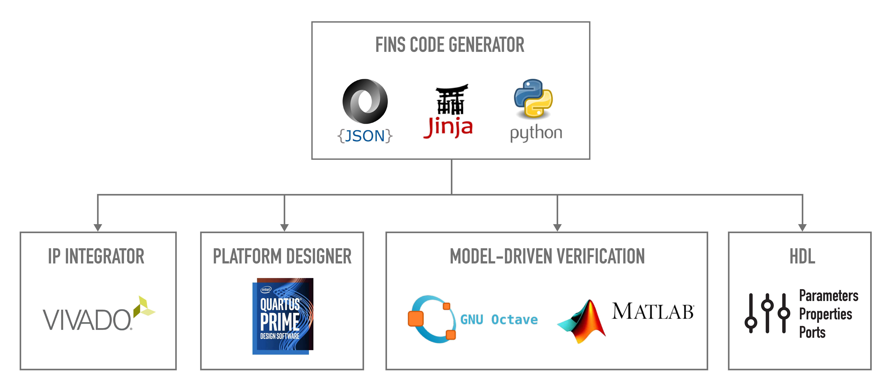

Firmware Intellectual Property (IP) Node Specification (FINS) is an innovative software tool chain from Geon Technologies that defines a programmable logic processing module and automates the firmware design, verification, and integration workflows. The foundation of FINS is the definition of a modular IP (intellectual property) node with a human-readable JSON schema. The schema specification is the launching point for code generators to accelerate embedded systems development. Programmable logic development is automated for the following areas:

1. **IP Build and Simulation Workflows.** TCL and Makefile scripts generated by FINS automate the build and simulation of IP. IP modules can be built for compatibility with Xilinx Vivado IP Integrator or Intel Quartus Platform Designer which enables rapid insertion of IP in platform code and vendor reference designs.
2. **Rapid Reconfiguration.** FINS consolidates parameterization of IP into a single location and distributes these parameters across design tools with code generation of header-like package files.
3. **Properties and Ports Interfaces.** FINS generates HDL source code for a properties interface that enables repeatable software control of firmware and for a ports interface that standardizes firmware to firmware movement of data.



## License

The license for FINS source code is LGPLv3.0, but code generated by FINS does not assume this license. Generated code can be explicitly defined as proprietary when setting the `license_file` key of the FINS JSON file.

## Prerequisites

The software packages required to use FINS are:

* Xilinx Vivado (Tested with 2021.2 and 2022.2) **and/or** Intel Quartus (Tested with 19.4)
* GNU Make
* Python 3.6 with setuptools 41.2.0
* Jinja2
* GNU Octave **and/or** Mathworks MATLAB

## Installation

> NOTE: You may need to upgrade your version of pip and setuptools before installing FINS. To perform this upgrade, execute the command: `sudo python3 -m pip install --upgrade pip setuptools`.

### Install Fins:

```bash
cd fins/
# Install the FINS software and "core" generator:
python3 -m pip install .
# Install the "vivado" generator plugin:
python3 -m pip install ./vivado
# Install the "quartus" generator plugin:
python3 -m pip install ./quartus
```

### Enable `fins` in your `PATH`:

```bash
export PATH=$PATH:/home/$USER/.local/bin
```
### Enable Quartus or Vivado

> NOTE: The examples below assume Vivado **and/or** Quartus is installed in the `/opt` directory.  
> NOTE: Only a single tool needs to be setup.  

#### Vivado setup

```bash
source /opt/Xilinx/Vivado/2022.2/settings64.sh
```

#### Quartus setup

```bash
export QUARTUS_ROOTDIR=/opt/intelFPGA_pro/19.4/quartus
export PATH="$PATH:$QUARTUS_ROOTDIR/bin:$QUARTUS_ROOTDIR/sopc_builder/bin:$QUARTUS_ROOTDIR/../modelsim_ase/bin:"
```

### Test Installation:

To verify your installation and run an example of a FINS Node, execute the following commands to build and simulate the test IP:

#### Test Vivado

```bash
# Enter the test IP directory:
cd fins/test/node/
# Run the fins executable to generate the Vivado backend:
fins -b vivado fins.json
# Build the core:
make
# Run the simulation in command line mode:
make sim
# Use the following to simulate the core using the GUI
# make sim UseGui=1
```

#### Test Quartus

```bash
# Enter the test IP directory:
cd fins/test/node/
# Run the fins executable to generate the Quartus backend:
fins -b quartus fins.json
# Build the core:
make
# Run the simulation in command line mode:
make sim
# Use the following to simulate the core using the GUI
# make sim UseGui=1
```

The log files below contain the details of operations in the FINS execution process:

* **fins/test/node/log/ip_create.log**: This log file contains the details of each step executed to build the "test_top" IP.
* **fins/test/node/log/ip_simulate.log**: This log file contains the details of each step executed to simulate the "test_top" IP.

### To Uninstall:

> NOTE: You may not have permissions to run these `python3 -m pip` commands. To resolve this you can either use a python virtual environment, the `--user` option, or `sudo`.

```bash
python3 -m pip uninstall fins fins-quartus fins-vivado
```

## Learning FINS

A FINS "**Node**" is a single modular, resuable firmware Intellectual Property (IP). A Node serves as the foundation of FINS. See the link below for more information on development of a "Node".

* [Node Development](./docs/development.md)

To follow a tutorial on how to create a simple "power_converter" FINS Node, see the link below.

* [Power Converter Tutorial](./docs/tutorial1.md)

See the links below for detailed documentation on elements of a FINS Node.

* [Node Parameters](./docs/parameters.md)
* [Node Properties](./docs/properties.md)
* [Node Ports](./docs/ports.md)
* [Node Filesets](./docs/filesets.md)
* [Node Sub-IP](./docs/sub-ip.md)

There are two important FINS constructs used for integration: [**Applications**](./docs/applications.md) and [**Systems**](./docs/systems.md). These are elaborated on in [FINS Integration](./docs/integration.md), but to get started follow the tutorial on how to create a simple "power_application" FINS Application.

* [Power Converter Application Tutorial](./docs/tutorial2.md)

## Notes

Here are a few things to keep in mind when developing FINS IP:
* Xilinx's AXI Interconnect only supports 32bit data widths for AXI4-Lite, but Intel's AXI Interconnect supports both 32bit and 64bit data widths of the AXI4-Lite standard.
* Xilinx's AXI Interconnect creates slave AXI4-Lite byte-indexed buses, whereas Intel's AXI Interconnect creates slave AXI4-Lite word-indexed buses.
* FINS currently generates only VHDL for all HDL code. Verilog user code may require a translation layer of properties and ports records.
* When switching between vendors, you will need to change the part specified in the FINS Node JSON file. You may also find it convenient to specify a top-level FINS parameter to define the vendor that can be used in the HDL in "generate" statements.
* The "quartus" backend does not support a Verilog file as its top-level source file.
* No directory paths should have spaces. For example, `/home/user/Documents/project 1/` is invalid.

The AXI4-Lite buses and AXI4-Stream buses used in the top-level source file have strict requirements for their signals used and their naming. Every bus must have both clock and reset with signal names `aclk` and `aresetn`, respectively. The naming conventions are listed below.

* AXI4-Lite: `["m" or "s"][OPTIONAL_DECIMAL_NUMBER]_axi_[OPTIONAL_BUS_NAME]_[SIGNAL_NAME]`
* AXI4-Stream: `["m" or "s"][OPTIONAL_DECIMAL_NUMBER]_axis_[PORT_NAME]_[SIGNAL_NAME]`

## Contributing to FINS

To develop FINS templates or Python code, it is strongly recommended to use a virtual environment with an "editable" install:

```bash
cd fins/
python3 -m pip install virtualenv
python3 -m venv env
source env/bin/activate
python3 -m pip install -e .
python3 -m pip install -e ./vivado
python3 -m pip install -e ./quartus
```

## Testing Changes to FINS

A few tests must be run through in order to validate changes to FINS. These tests cover FINS Nodes, Applications and Systems.

> NOTE: These tests require both Octave and MATLAB.
> NOTE: `make sim UseGui` can be used to run the simulation in Gui Mode.

### Testing FINS Nodes

Test that FINS can successfully parse Node JSON, generate an IP and testbench, and simulate the result.

#### Test Vivado

```bash
# Enter the test IP directory:
cd fins/test/node/
# Run the fins executable to generate the Vivado backend:
fins -b vivado fins.json
# Build the core:
make
# Run the simulation in command line mode:
make sim
# Use the following to simulate the core using the GUI
# make sim UseGui=1
```

#### Test Quartus

```bash
# Enter the test IP directory:
cd fins/test/node/
# Run the fins executable to generate the Quartus backend:
fins -b quartus fins.json
# Build the core:
make
# Run the simulation in command line mode:
make sim
# Use the following to simulate the core using the GUI
# make sim UseGui=1
```

### Testing FINS Applications

Test that FINS can successfully parse Application JSON, instantiate Nodes in an Application, and generate and simulate a testbench.

#### Test Vivado

```bash
# Enter the test application directory:
cd fins/test/application/
# Run the fins executable to generate the Vivado backend:
fins -b vivado application_test.json
# Build the core:
make
# Run the simulation in command line mode:
make sim
# Use the following to simulate the core using the GUI
# make sim UseGui=1
```

#### Test Quartus

```bash
# Enter the test application directory:
cd fins/test/application/
# Run the fins executable to generate the Quartus backend:
fins -b quartus application_test.json
# Build the core:
make
# Run the simulation in command line mode:
make sim
# Use the following to simulate the core using the GUI
# make sim UseGui=1
```

### Testing FINS Systems

Test that FINS can successfully parse a System JSON file

#### Test Vivado

> NOTE: The `Vivado` execution requires the `avnet.com:zedboard:part0:1.5` board part.

```bash
# Install the zedboard board part (If not installed):
git clone https://github.com/Avnet/bdf.git
sudo mv bdf/zed*  /opt/Xilinx/Vivado/2022.2/data/xhub/boards/XilinxBoardStore/boards/Avnet/
# Test FINS System:
cd fins/test/system/
make
fins vivado_system_test.json
```

#### Test Quartus

```bash
cd fins/test/system/
make
fins quartus_system_test.json
```

### Additional Testing

Additional FINS Nodes and an Application live in `tutorials/` and can be useful for testing.
