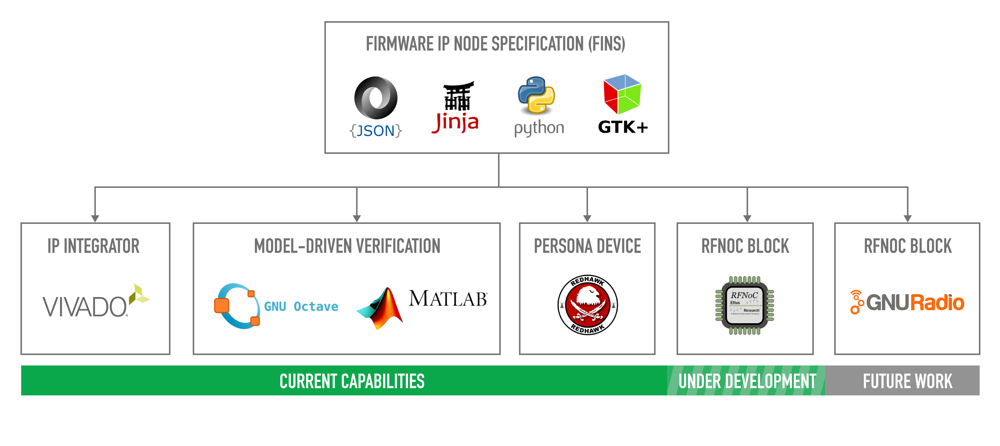

This repository contains software that implements the JavaScript Object Notation (JSON) Firmware IP Node Specification (FINS).



## Description

Firmware IP Node Specification (FINS) is an innovative Geon software tool chain that defines a programmable logic processing module and automates the firmware design, verification, and integration workflows. The foundation of FINS is the definition of a modular IP (intellectual property) node with a human-readable JSON schema. Geon has focused on several core capabilities that use this schema to accelerate embedded systems development. 

The first capability is the rapid reconfiguration and insertion of firmware IP. Firmware IP is often designed as a single-use module, and significant effort is required to apply this IP to other solutions. With a single update to the JSON schema, the FINS automation software reconfigures the IP and all its dependencies. Transitioning between programmable logic platforms is also usually a time-consuming problem. FINS generates portable modules compatible with firmware integration tools and platform board support layers, easing this problem. Geon has successfully used this technology with the Xilinx Vivado IP Integrator integration tool, Analog Devices board support layers, and Ettus Research board support layers, creating portable and re-useable firmware modules that substantially reduce IP integration time. 

The second capability is the model-driven verification of firmware IP. Firmware IP models provide unit simulations for verification from behavioral-level to bit-level. Modeling tools such as MATLAB or GNU Octave excel at data generation and analysis, a weakness of hardware description languages. Through FINS, Geon uses modeling tools to unit test firmware IP nodes, optimizing data accuracy, data throughput, and processing capacity. 

The final capability is the code generation of both firmware and software to manage the boundary between these two domains. FINS defines and propagates software configurable properties to both firmware and software configurations. This automation capability integrates with the REDHAWK SDR architecture to deploy the firmware IP node, enabling component deployment to the remote sensor or other systems. 

## Prerequisites

This repository relies upon submodules, so make sure you use the `--recurse-submodules` flag when cloning this repository. If you forget to use that flag, then execute `git submodule update --init --recursive`.

The software packages required to use FINS are:
 * [Xilinx Vivado](https://www.xilinx.com/products/design-tools/vivado.html) (Tested with 2015.4, 2016.2, and 2018.2)
 * [GNU Make](https://www.gnu.org/software/make/)
 * [Python](https://www.python.org/) (Tested with 2.7)
 * [Jinja2](http://jinja.pocoo.org/)
 * [PyGTK+](http://www.pygtk.org/)
 * [GNU Octave](https://www.gnu.org/software/octave/) or [Mathworks MATLAB](https://www.mathworks.com/products/matlab.html)

## Getting Started

To start using FINS, add FINS as a submodule by executing the following commands in the root of your firmware IP module repository:

```bash
$ git submodule add git@curiosity.office.geontech.com:firmware/fins.git
$ git submodule update --init --recursive
```

Next, you must have a `fins.json` file in the root of your repository with the following contents at a minimum:

```json
{
    "name":"elite_firmware_ip"
}
```

Execute the following command in the root of your repository to autogenerate the top-level `Makefile` and `.gitignore`:

```bash
$ python ./fins/repo/scripts/gen_repo.py
```

The next step is to fill out the required keys of the `fins.json` file and design your top-level code and testbench. Once everything is all setup, you may now use the `make` command with the following targets:

* `all`: (Default) Builds and packages the intellectual property with Vivado
* `fins`: Uses Jinja2 to generate the firmware IP node specification files
* `sim`: Runs the simulation
* `netlist`: Synthesizes the intellectual property into a single netlist
* `clean`: Deletes all parameter files, temporary files, and project files for this repository only
* `clean-all`: Deletes all parameter files, temporary files, and project files for this repository and all submodule IP repositories

**Notes:**
* To use the `sim` target, your top level testbench must terminate all signal activity when finished and must have a boolean signal called `simulation_done` that is `true` at the end of the simulation.
* When developing the `fins.json` file, the `make fins` command will be very helpful
* To use modeling tools like Octave or MATLAB with the `sim` target, you must define the top-level key `modeling_tool` in `fins.json` and set it to "octave" or "matlab". Once that key is defined, you must have two files in the root of your repository: `sim_setup.m` which is run before the HDL simulation and `sim_verify.m` which is run after the HDL simulation.

## Block Diagrams

### Execution Flow and Inputs/Outputs


### FINS "Streams" Simulation Automation


