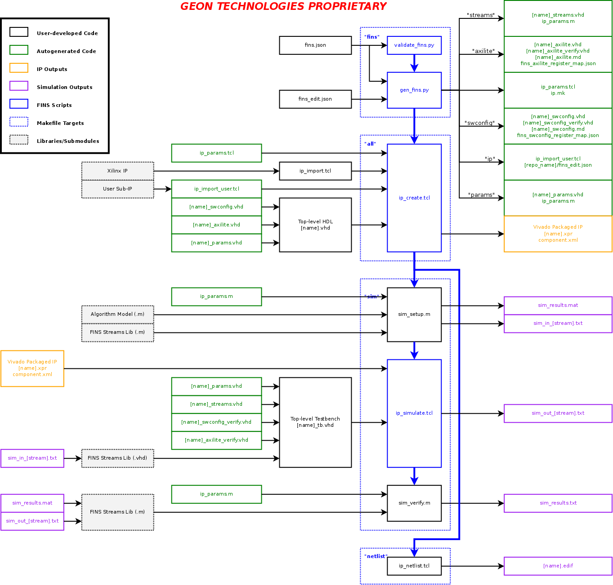
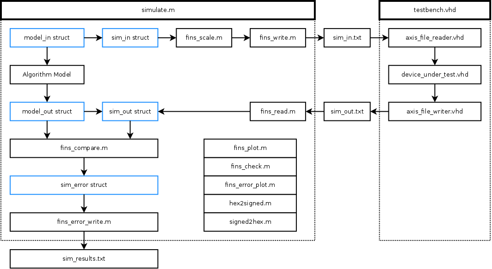
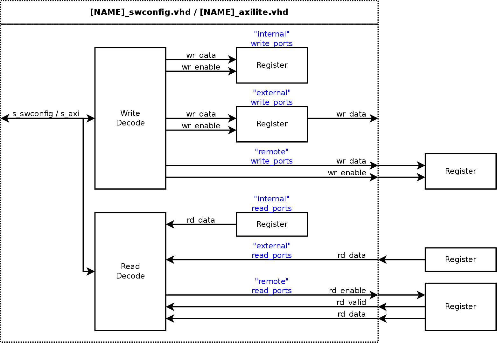

This repository contains software that implements the JavaScript Object Notation (JSON) Firmware IP Node Specification (FINS).

## Description

Firmware IP Node Specification (FINS) is an innovative Geon software tool chain that defines a programmable logic processing module and automates the firmware design, verification, and integration workflows. The foundation of FINS is the definition of a modular IP (intellectual property) node with a human-readable JSON schema. Geon has focused on several core capabilities that use this schema to accelerate embedded systems development. 

The first capability is the rapid reconfiguration and insertion of firmware IP. Firmware IP is often designed as a single-use module, and significant effort is required to apply this IP to other solutions. With a single update to the JSON schema, the FINS automation software reconfigures the IP and all its dependencies. Transitioning between programmable logic platforms is also usually a time-consuming problem. FINS generates portable modules compatible with firmware integration tools and platform board support layers, easing this problem. Geon has successfully used this technology with the Xilinx Vivado IP Integrator integration tool, Analog Devices board support layers, and Ettus Research board support layers, creating portable and re-useable firmware modules that substantially reduce IP integration time. 

The second capability is the model-driven verification of firmware IP. Firmware IP models provide unit simulations for verification from behavioral-level to bit-level. Modeling tools such as MATLAB or GNU Octave excel at data generation and analysis, a weakness of hardware description languages. Through FINS, Geon uses modeling tools to unit test firmware IP nodes, optimizing data accuracy, data throughput, and processing capacity. 

The final capability is the code generation of both firmware and software to manage the boundary between these two domains. FINS defines and propagates software configurable properties to both firmware and software configurations. This automation capability integrates with the REDHAWK SDR architecture to deploy the firmware IP node, enabling component deployment to the remote sensor or other systems. 

## Prerequisites

This repository relies upon submodules, so make sure you use the `--recurse-submodules` flag when cloning this repository. If you forget to use that flag, then execute `git submodule update --init --recursive`.

The software packages required to use FINS are:
 * [Xilinx Vivado](https://www.xilinx.com/products/design-tools/vivado.html) (Tested with 2015.4, 2016.2, and 2018.2)
 * [GNU Make](https://www.gnu.org/software/make/)
 * [Python](https://www.python.org/) (Tested with 2.7)
 * [Jinja2](http://jinja.pocoo.org/)
 * [PyGTK+](http://www.pygtk.org/)
 * [GNU Octave](https://www.gnu.org/software/octave/) or [Mathworks MATLAB](https://www.mathworks.com/products/matlab.html)

## Getting Started

To start using FINS, add FINS as a submodule by executing the following commands in the root of your firmware IP module repository:

```bash
$ git submodule add git@curiosity.office.geontech.com:firmware/fins.git
$ git submodule update --init --recursive
```

Next, you must have a `fins.json` file in the root of your repository with the following contents at a minimum:

```json
{
    "name":"elite_firmware_ip"
}
```

Execute the following command in the root of your repository to autogenerate the top-level `Makefile` and `.gitignore`:

```bash
$ python ./fins/repo/scripts/gen_repo.py
```

The next step is to fill out the required keys of the `fins.json` file and design your top-level code and testbench. Once everything is all setup, you may now use the `make` command with the following targets:

* `all`: (Default) Builds and packages the intellectual property with Vivado
* `fins`: Uses Jinja2 to generate the firmware IP node specification files
* `sim`: Runs the simulation
* `netlist`: Synthesizes the intellectual property into a single netlist
* `clean`: Deletes all parameter files, temporary files, and project files for this repository only
* `clean-all`: Deletes all parameter files, temporary files, and project files for this repository and all submodule IP repositories

**Notes:**
* To use the `sim` target, your top level testbench must terminate all signal activity when finished and must have a boolean signal called `simulation_done` that is `true` at the end of the simulation.
* When developing the `fins.json` file, the `make fins` command will be very helpful
* To use modeling tools like Octave or MATLAB with the `sim` target, you must define the top-level key `modeling_tool` in `fins.json` and set it to "octave" or "matlab". Once that key is defined, you must have two files in the root of your repository: `sim_setup.m` which is run before the HDL simulation and `sim_verify.m` which is run after the HDL simulation.

## Execution Flow and Inputs/Outputs

The diagram below describes in detail the execution flow for the various Makefile targets, along with the inputs and outputs of each stage.



## "streams" Simulation Automation

The diagram below describes in detail the flow of data between Octave/MATLAB and the HDL testbench when using the "streams" simulation automation tools for model-driven design.



## "regs" Register Dictionary List

### Overview

Within the FINS schema, there are two locations where a list of register dictionaries may be defined. The definition of the register dictionary is identical for both locations - within the `swconfig` and the `axilite` top-level keys. See the code below to view the locations of the register dictionary lists.

```json
"swconfig":{
    "regions":[
        {
            "regs":[]
        }
    ]
},
"axilite":{
    "regs":[]
}
```

A detailed explanation of the keys within each register dictionary is located in the table below. If a key is not defined in a `fins.json` file, then the default value is automatically set before generating code. Some of the keys of the register dictionary may be set by assigning a string that links to an entry in the `params` top-level key. The linked parameter is converted to a literal value before code generation.

> ***NOTE:*** In the table below, the terminology of "physical register" and "logical register" are used. A "physical register" refers to a 32bit word that is read and written to from a single address in the memory map. A "logical register" is the definition of a register within the `fins.json` file, and it refers to the usable representation of the physical register(s), including limitations on use and implementation details.

| Key                  | Type                                  | Required | Default Value | Value Restrictions                  | Description |
| -------------------- | ------------------------------------- | -------- | ------------- | ----------------------------------- | ----------- |
| name                 | string                                | YES      | N/A           |                                     | The name of the register. It must be unique from other registers within the list. |
| description          | string                                | NO       | N/A           |                                     | The description of the register. It should contain information about how to use the register and any limitations. |
| width                | uint or `fins["params"][N]["name"]`   | NO       | 32            | 1 to 32                             | The number of bits used within the physical register. If the width is less than 32, the bits of the logical register are located in the LSBs of the physical register. For example, `width = 12` means that the `logcial_register == physical_register[11:0]` |
| length               | uint or `fins["params"][N]["name"]`   | NO       | 1             | 1 to Available Address Space        | The number of physical registers to use for this logical register. All other definitions of this logical register are duplicated for each physical register except for the `default_values` key. |
| default_values       | uint[] or `fins["params"][N]["name"]` | NO       | 0             | 0 to 2^32-1                         | The default setting after power-on or reset. The length of this array should match the `length` key. |
| is_writable          | bool or `fins["params"][N]["name"]`   | NO       | true          |                                     | A flag indicating if the register is writable from software. |
| write_ports          | string                                | NO       | "external"    | "internal", "external", or "remote" | The implementation of the register write ports on the generated HDL module. See the section below for more details. |
| is_readable          | bool or `fins["params"][N]["name"]`   | NO       | true          |                                     | A flag indicating if the register is readable from software. |
| read_ports           | string                                | NO       | "internal"    | "internal", "external", or "remote" | The implementation of the register read ports on the generated HDL module. See the section below for more details. |
| is_read_from_write   | bool or `fins["params"][N]["name"]`   | NO       | true          |                                     | A flag indicating if the read data comes from the write data. It lets the software know that if a value is written then the same value may be read back. |
| range_min            | uint or `fins["params"][N]["name"]`   | NO       | 0             | 0 to 2^32-1                         | The minimum value of the register. It instructs the software to not set invalid values in the firmware. |
| range_max            | uint or `fins["params"][N]["name"]`   | NO       | 2^(`width`)   | 0 to 2^32-1                         | The maximum value of the register. It instructs the software to not set invalid values in the firmware. |
| is_ram               | bool or `fins["params"][N]["name"]`   | NO       | false         |                                     | A flag indicating if this logical register references a RAM. If true, the `length` must be set to the full size of the RAM, the `default_values` must not be set, and RAMs cannot be in the same region as normal registers. Not supported for AXILITE. |
| is_signed            | bool or `fins["params"][N]["name"]`   | NO       | false         | false ONLY                          | [NOT IMPLEMENTED] A flag indicating if the register is signed. |

### Read/Write Ports

The `read_ports` and `write_ports` keys instruct the code generation to create different types of registers within the `swconfig` or `axilite` HDL module. The diagram below explains in more detail what code is generated when different options are selected.



The usage of the `read_ports` and `write_ports` keys of the register dictionary in concert with the `is_readable`, `is_writable`, and `is_read_from_write` keys can be complicated and requires additional explanation. The table below details all the combinations and usages.

| is_writable   | write_ports   | is_readable   | read_ports   | is_read_from_write   | Exposed Ports                                                    | Description |
| ------------- | ------------- | ------------- | ------------ | -------------------- | ---------------------------------------------------------------- | ----------- |
| true          | "internal"    | true          | "internal"   | true                 | None                                                             | Register exists internally to decode module but is inaccessible by the rest of the firmware. This is only good for a wrapback register to test the functionality of the bus. |
| true          | "internal"    | true          | "internal"   | false                | None                                                             | INVALID: Read IS from write |
| true          | "internal"    | true          | "external"   | true                 | rd_data                                                          | INVALID: Read IS NOT from write |
| true          | "internal"    | true          | "external"   | false                | rd_data                                                          | IMPRACTICAL: No point to having `is_writable=true` |
| true          | "internal"    | true          | "remote"     | true                 | rd_data<br />rd_enable<br />rd_valid                             | INVALID: Read IS NOT from write |
| true          | "internal"    | true          | "remote"     | false                | rd_data<br />rd_enable<br />rd_valid                             | IMPRACTICAL: No point to having `is_writable=true` |
| true          | "internal"    | false         | N/A          | N/A                  | None                                                             | IMPRACTICAL: Register has no function |
| true          | "external"    | true          | "internal"   | true                 | wr_data                                                          | This the default. Register exists internally to decode module |
| true          | "external"    | true          | "internal"   | false                | wr_data                                                          | INVALID: Read IS from write |
| true          | "external"    | true          | "external"   | true                 | wr_data<br />rd_data                                             | IMPRACTICAL: No point to making `read_ports="external"` because you need to set `rd_data=wr_data` to satisfy `is_read_from_write=true`. Set `read_ports="internal"` |
| true          | "external"    | true          | "external"   | false                | wr_data<br />rd_data                                             | Write register exists internally to decode module, but the read back value is external |
| true          | "external"    | true          | "remote"     | true                 | wr_data<br />rd_data<br />rd_enable<br />rd_valid                | Write register exists internally to decode module, and `rd_data` must be assigned to `wr_data` to satisfy `is_read_from_write` condition |
| true          | "external"    | true          | "remote"     | false                | wr_data<br />rd_data<br />rd_enable<br />rd_valid                | Write register exists internally to decode module, and `rd_data` must NOT be assigned to `wr_data` to satisfy `is_read_from_write` condition |
| true          | "external"    | false         | N/A          | N/A                  | wr_data                                                          | IMPRACTICAL: Write register exists internally to decode module but cannot be read. Instead set `is_readable=true` and `read_ports="internal"` so that software can read the value |
| true          | "remote"      | true          | "internal"   | true                 | wr_data<br />wr_enable                                           | INVALID: Read IS NOT from write. Internal read makes no sense when `write_ports="remote"` |
| true          | "remote"      | true          | "internal"   | false                | wr_data<br />wr_enable                                           | IMPRACTICAL: Internal read makes no sense when `write_ports="remote"` |
| true          | "remote"      | true          | "external"   | true                 | wr_data<br />wr_enable<br />rd_data                              | Write register exists outside of decode module, and `rd_data` must be assigned to `wr_data` to satisfy `is_read_from_write` condition |
| true          | "remote"      | true          | "external"   | false                | wr_data<br />wr_enable<br />rd_data                              | Write register exists outside of decode module, and `rd_data` must NOT be assigned to `wr_data` to satisfy `is_read_from_write` condition |
| true          | "remote"      | true          | "remote"     | true                 | wr_data<br />wr_enable<br />rd_data<br />rd_enable<br />rd_valid | Write register exists outside of decode module, and `rd_data` must be assigned to `wr_data` to satisfy `is_read_from_write` condition |
| true          | "remote"      | true          | "remote"     | false                | wr_data<br />wr_enable<br />rd_data<br />rd_enable<br />rd_valid | Write register exists outside of decode module, and `rd_data` must NOT be assigned to `wr_data` to satisfy `is_read_from_write` condition |
| true          | "remote"      | false         | N/A          | N/A                  | wr_data<br />wr_enable                                           | Write register exists outside of decode module and cannot be read |
| false         | N/A           | true          | "internal"   | N/A                  | None                                                             | Register exists internally to the decode module but is a constant. This is good for a version register or some other fixed value. |
| false         | N/A           | true          | "external"   | N/A                  | rd_data                                                          | Register does not exist internally to the decode module. Read is external, so this is good for a status or to provide insight to any value in the design. |
| false         | N/A           | true          | "remote"     | N/A                  | rd_data<br />rd_enable<br />rd_valid                             | Register does not exist internally to the decode module. Read is remote, so this is good for a read from an "actionable" element of your design like a FIFO that needs a read enable. |
| false         | N/A           | false         | N/A          | N/A                  | None                                                             | INVALID: Register has no function |
