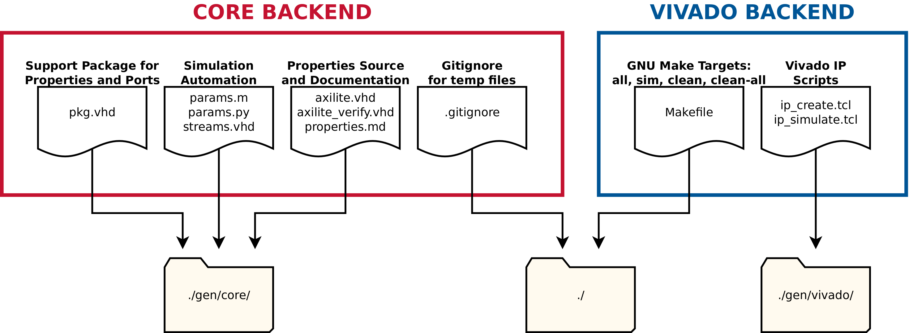
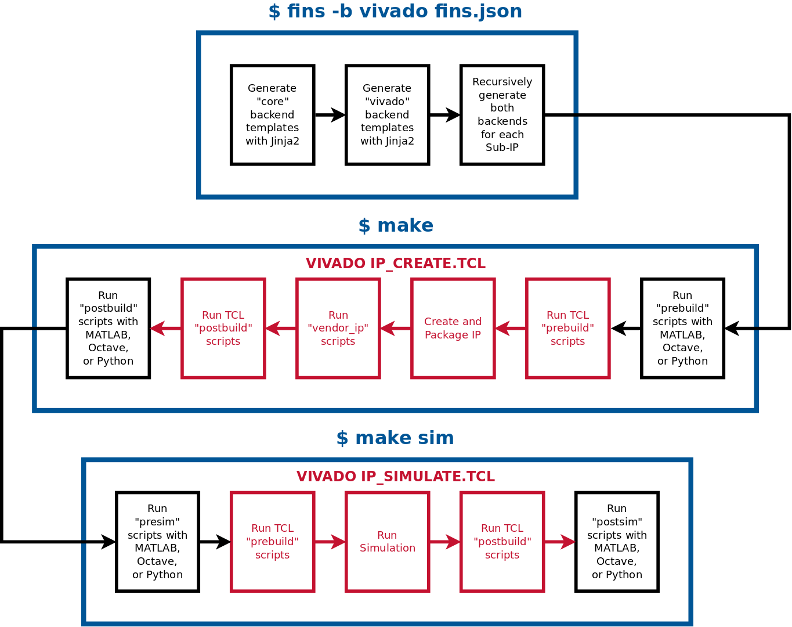

This repository contains a software package that implements the JavaScript Object Notation (JSON) Firmware IP Node Specification (FINS).

## Description

Firmware IP Node Specification (FINS) is an innovative Geon software tool chain that defines a programmable logic processing module and automates the firmware design, verification, and integration workflows. The foundation of FINS is the definition of a modular IP (intellectual property) node with a human-readable JSON schema, and this schema is augmented with code generators to accelerate embedded systems development. Programmable logic development is automated for the following areas:

1. **IP Build and Simulation Workflows.** FINS generates TCL and Makefile scripts to automate the process of building and simulating packaged IP modules. Source files and vendor IP are added to vendor tool projects, and scripts are automatically executed within the build and simulation flows. Packaged IP modules are immediately compatible with vendor tools (Vivado IP Integrator, Intel Platform Designer) and enable rapid insertion of IP into platform code and reference designs.
2. **Properties Interfaces.** FINS generates HDL source code to handle software-firmware communication through a properties interface.
3. **Model-Driven Simulation.** FINS generates HDL testbench code along with Octave and Python header files to assist in model-driven simulation flows.

## Prerequisites

The software packages required to use FINS are:
 * [Xilinx Vivado](https://www.xilinx.com/products/design-tools/vivado.html) (Tested with 2015.4, 2016.2, and 2018.2)
 * [GNU Make](https://www.gnu.org/software/make/)
 * [Python 3.6](https://www.python.org/)
 * [Jinja2](http://jinja.pocoo.org/)
 * [GNU Octave](https://www.gnu.org/software/octave/)

## Quick Start

Follow the commands below to get started with FINS and run the test example IP with Vivado:

```bash
# Install the "core" generator backend
$ sudo python3 -m pip install .
# Install the "vivado" generator backend
$ sudo python3 -m pip install vivado
# Enter the test IP directory
$ cd ./test/
# Run the fins executable
$ fins -b vivado zynq_no_matlab.json
# Run the simulation in command line mode
$ make sim
```

## Installation

Run the following commands from the root of this repository to install the FINS Python package:

```bash
# Install the "core" generator backend
$ sudo python3 -m pip install .
# Install the "vivado" generator backend
$ sudo python3 -m pip install vivado
```

To uninstall FINS, run the following command:

```bash
$ sudo python3 -m pip uninstall fins
```

## Usage

Once installed, use the `fins` executable to run the code generation for the different backends. When generating the `vivado` backend, the `core` backend is also generated. The diagram below shows the files generated for each available backend.



Here are examples of using `fins` to generate the different backends:

```bash
# Generate the "core" backend
$ fins -b core fins.json
# Generate the "core" and "vivado" backends
$ fins -b vivado fins.json
```

After running `fins` with the `vivado` backend, you may now use the `make` command with the following targets:

* `all`: (Default) Builds and packages the intellectual property with Vivado
* `sim`: Runs the simulation, depends on `all` target
* `clean`: Deletes all temporary and project files for this repository only
* `clean-all`: Deletes all temporary and project files for this repository and all submodule IP repositories

When running the `make` command, you have the option of viewing the console output and watching the GUI-based tools execute the scripts. To use this mode in the IP build and simulation process, set the `UseGui` variable to `1` like the example below. Note that you will need to close the Vivado window in order to proceed with both the build and simulation processes.

```bash
$ make sim UseGui=1
```

The following diagram shows the sequence of operations that takes place when using the `fins` executable with the `vivado` backend and when using the `all` and `sim` Makefile targets:



## Properties

Properties are software-controllable registers within the programmable logic. The properties interface has a few settings that determine the underlying bus characteristics:

* `addr_width`: The address width of the underlying memory-mapped bus.
* `data_width`: The data width of the underlying memory-mapped bus. This setting also determines the default bit width of each property. The maximum value for this setting is 128.
* `is_addr_byte_indexed`: A boolean that determines if each increment by 1 of the address corresponds to a byte or to a word (the full `data_width`).

The properties interface has a list of property dictionaries which can have the fields listed in the following table.

| Key            | Type   | Required | Default Value | Value Restrictions           | Description |
| -------------- | ------ | -------- | ------------- | ---------------------------- | ----------- |
| name           | string | YES      | N/A           |                              | The name of the register. It must be unique from other registers within the IP. |
| type           | string | YES      | N/A           | read-only-constant<br />read-only-data<br />read-only-external<br />read-only-memmap<br />write-only-external<br />write-only-memmap<br />read-write-internal<br />read-write-data<br />read-write-external<br />read-write-memmap | The type of the property. The enumerations of the property are described in detail in the table below. |
| description    | string | NO       | N/A           |                              | The description of the register. It should contain information about how to use the register and any limitations. |
| width          | uint   | NO       | `data_width`  | 1 to `data_width`            | The number of bits used to represent the property. If `width` is less than `data_width`, the bits of the property are physically located in the LSBs of the `data_width` register. |
| length         | uint   | NO       | 1             | 1 to Available Address Space | The number of addresses to use for this property. When `length` is greater than 1, the property is considered a "sequence" property. Each item of the sequence is identical in definition and is represented by a single address. |
| default_values | uint[] | NO       | 0             | 0 to 2^`data_width`-1        | The default setting after power-on or reset. The length of this array MUST match the `length` key. |
| range_min      | uint   | NO       | 0             | 0 to 2^`data_width`-1        | The minimum value of the register. This setting is unused in the firmware code but is used in the software to not set invalid values in the firmware. |
| range_max      | uint   | NO       | 2^(`width`)-1 | 0 to 2^`data_width`-1        | The maximum value of the register. This setting is unused in the firmware code but is used in the software to not set invalid values in the firmware. |
| is_signed      | bool   | NO       | false         | false ONLY                   | [NOT IMPLEMENTED] A flag indicating if the register is signed. |

Properties in a FINS JSON file autogenerate into a decode module that uses records defined in the VHDL package file. This module interacts with user HDL through the `props_control` and `props_status` record interfaces which are defined in the auto-generated VHDL package file. `props_control` contains the signals that go from the AXI4-Lite decode module to user HDL, and `props_status` contains the signals that go from user HDL to the AXI4-Lite decode module. These top-level records have a field for each property that can interact with other HDL (all but the `read-only-constant` and `read-write-internal` property types). Each property in turn has fields that specify the interface with the user HDL. The accessibility of the property and the fields of the records are set based on the type. The table below has additional information on the property types and the available fields for each type.

| type                | props_control Record Fields                             | props_status Record Fields | Description |
| ------------------- | --------------------------------------------------------| -------------------------- | ----------- |
| read-only-constant  | None                                                    | None                       | Read-only constant property. A read of this property will only return the value set in the `default_values` field. Example usage: Version code, address space alignment null property. |
| read-only-data      | None                                                    | rd_data                    | Read-only data property. This property is used to read the value of non-interactive data that is immediately available. Example usage: Status bits, status counters. |
| read-only-external  | rd_en                                                   | rd_data<br />rd_valid      | Read-only external property. This property is used to read the value of interactive elements where data must be retrieved with control signals. Example usage: FIFO read. |
| read-only-memmap    | rd_en<br />rd_addr                                      | rd_data<br />rd_valid      | Read-only memory mapped property. This property is used to read the value of interactive elements where data must be retrieved using an address. Example usage: BRAM read. |
| write-only-external | wr_en<br />wr_data                                      | None                       | Write-only external property. This property is used to write the value of interactive elements where data must be set with control signals. The write enable may also be used by itself as an activation strobe. Example usage: FIFO write, dynamic control register write, processing start strobe. |
| write-only-memmap   | wr_en<br />wr_data<br />wr_addr                         | None                       | Write-only memory mapped property. This property is used to write the value of interactive elements where data must be set using an address. Example usage: BRAM write. |
| read-write-internal | None                                                    | None                       | Readable and writable internal property. This property can ONLY be accessed by software and is used for bus testing. Example usage: Loopback register for bus verification. |
| read-write-data     | wr_data                                                 | None                       | Readable and writable data property. This property is used to read and write static data that is available for use in the HDL design. Example usage: Static control register, Enable register. |
| read-write-external | rd_en<br />wr_en<br />wr_data                           | rd_data<br />rd_valid      | Readable and writable external property. This property is used to read and write the value of interactive elements where data must be retrieved and set with control signals. Example usage: FIFO read/write, dynamic control register read/write. |
| read-write-memmap   | rd_en<br />rd_addr<br />wr_en<br />wr_data<br />wr_addr | rd_data<br />rd_valid      | Readable and writable memory mapped property. This property is used to read and write the value of interactive elements where data must be retrieved and set using an address. Example usage: BRAM read/write. |

A visualization of the property types is located in the diagram below.


## Sub-IP

When running the `fins` code generation, a top level IP that uses sub-IP listed in the FINS JSON file generates an override file for each sub-IP. This override file has the same name as the sub-IP's JSON file with ".override" appended to it. This override file gives a top level IP the ability to override parameters and part number of the sub-IP. After generating the ".override" file, the `fins` executable recursively runs code generation on all sub-IP.

## Development

To develop fins, it is strongly recommended to use a virtual environment.

```bash
$ sudo pip3 install virtualenv
$ python3 -m venv env
$ source env/bin/activate
$ pip3 install -e .
$ pip3 install -e vivado
```
