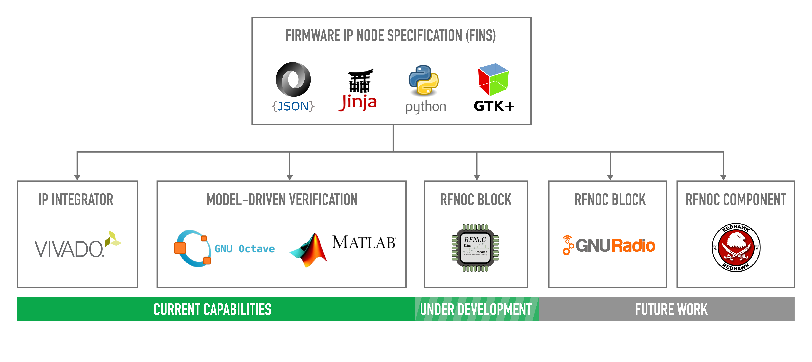
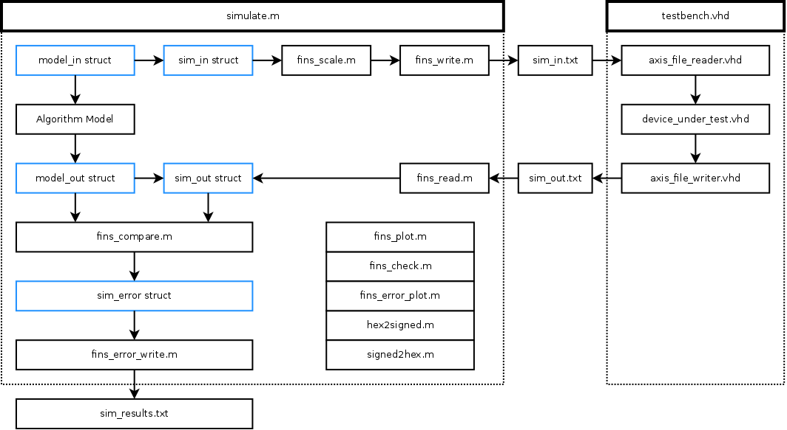
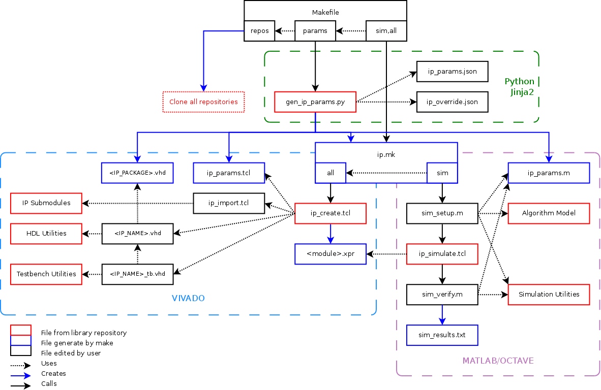

This repository contains Python scripts, Xilinx TCL scripts, MATLAB/Octave functions, and a PyGTK+ GUI for the rapid customization and generation of firmware intellectual property using the JSON-based Firmware IP Node Specification (FINS).

## Prerequisites

The software packages required to use FINS are:
 * [Xilinx Vivado](https://www.xilinx.com/products/design-tools/vivado.html) (Tested with 2015.4 and 2016.2)
 * [GNU Make](https://www.gnu.org/software/make/)
 * [Python](https://www.python.org/) (Tested with 2.7)
 * [Jinja2](http://jinja.pocoo.org/)
 * [PyGTK+](http://www.pygtk.org/)
 * [GNU Octave](https://www.gnu.org/software/octave/)
 * [Git](https://git-scm.com/)

## Getting Started

The best way to get started with FINS is to view our FIR Filter example [here](https://github.com/Geontech/fir_filter.git).

## Capabilities

Here is a brief description of the capabilities of FINS:

### GUI

A PyGTK+ GUI is provided to interact with the JSON FINS files. To launch the GUI, use the following commands:

    $ cd ./gui
    $ python fins_gui.py

A default set of parameters is provided to you when the GUI is launched, and click `File>Open` to modify an existing parameter file. The tabs of the GUI correspond to different sets of information stored in the JSON FINS files.

### FinStreams

FinStreams is a library of MATLAB/Octave functions used to model and simulate firmware IP. It is a stanalone library and can be used separate from the JSON FinSpecification.

To run an example of a stanalone usage of FinStreams, use the following commands:

    $ cd ./streams/examples/gain
    $ make

> Note: By default, GNU Octave is used for this example simulation. You can use MATLAB by typing `make matlab` instead of just `make`.

### Code Generation

The `codegen` folder contains scripts and templates for generation of HDL, MATLAB/Octave, and Xilinx TCL parameter files using Jinja2. Parameters from a JSON FINS file are inserted into the code generation templates for rapid customization of a firmware intellectual property module. The `Makefile` within the repository of the firmware IP module should control this code generation process as shown below.

For an example of the parameter generation, see our FIR Filter [here](https://github.com/Geontech/fir_filter.git).

### Xilinx TCL Scripts

The `xilinx` folder contains generic scripts for generating Vivado packaged IP, simulating using XSIM, and generating IP netlists. These scripts use the TCL parameter file from the code generation to generate specific IP.

As always, [let us know](https://geontech.com/contact-us/) how we can help you with all your FPGA and DSP needs!
