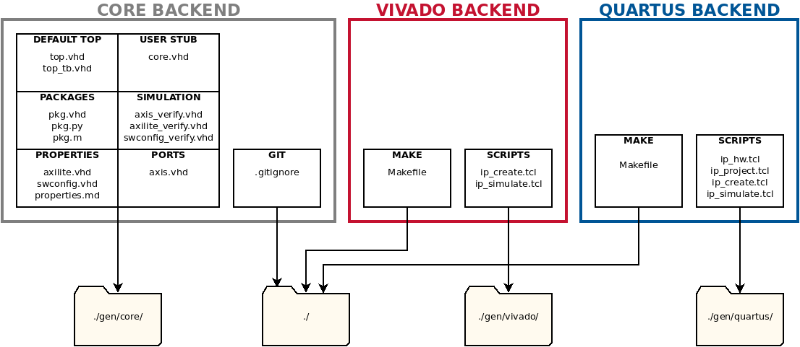
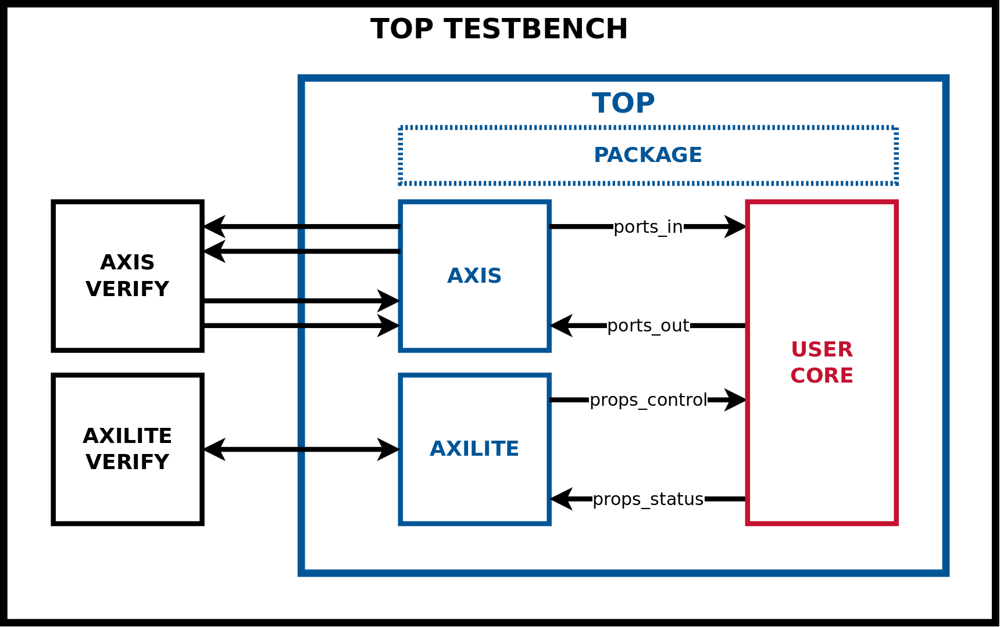

Firmware Intellectual Property (IP) Node Specification (FINS) is an innovative software tool chain from Geon Technologies that defines a programmable logic processing module and automates the firmware design, verification, and integration workflows. The foundation of FINS is the definition of a modular IP (intellectual property) node with a human-readable JSON schema. The schema specification is the launching point for code generators to accelerate embedded systems development. Programmable logic development is automated for the following areas:

1. **IP Build and Simulation Workflows.** TCL and Makefile scripts generated by FINS automate the build and simulation of IP. IP modules can be built for compatibility with Xilinx Vivado IP Integrator or Intel Quartus Platform Designer which enables rapid insertion of IP in platform code and vendor reference designs.
2. **Rapid Reconfiguration.** FINS consolidates parameterization of IP into a single location and distributes these parameters across design tools with code generation of header-like package files.
3. **Properties and Ports Interfaces.** FINS generates HDL source code for a properties interface that enables repeatable software control of firmware and for a ports interface that standardizes firmware to firmware movement of data.

## Prerequisites

The software packages required to use FINS are:

* Xilinx Vivado (Tested with 2018.2, 2018.3) and/or Intel Quartus Prime Pro (Tested with 19.1)
* GNU Make
* Python 3.6
* Jinja2
* GNU Octave and/or Mathworks MATLAB

## Installation

Run the following commands from the root of this repository to install the FINS Python package:

```bash
# Install the FINS software and "core" generator
$ sudo python3 -m pip install .
# Install the "vivado" generator plugin
$ sudo python3 -m pip install ./vivado
# Install the "quartus" generator plugin
$ sudo python3 -m pip install ./quartus
```

To uninstall FINS, run the following command:

```bash
$ sudo python3 -m pip uninstall fins
```

## TL;DR Example

To run an example of a FINS IP, execute the following commands to build and simulate the test IP with Vivado:

> NOTES: Make sure you have sourced the Xilinx "settings64.sh" script for the version of Vivado you are using. This example assumes you have Octave and not MATLAB.

```bash
# Enter the test IP directory
$ cd ./test/
# Run the fins executable to generate the Vivado backend
$ fins -b vivado zynq_no_matlab.json
# Run the simulation in command line mode
$ make sim
```

When the commands have finished executing, notice the following files and folders (relative to the root of the `./test` directory):

* **Makefile**: This is the Makefile that provides the `all` and `sim` targets for the "test_top" IP.
* **./gen/core/**: This directory contains the generated code from the "core" backend that was used by the "test_top" IP.
* **./gen/vivado/**: This directory contains the generated scripts from the "vivado" backend that built and simulated the "test_top" IP.
* **./log/ip_create.log**: This log file contains the details of each step executed to build the "test_top" IP.
* **./log/ip_simulate.log**: This log file contains the details of each step executed to simulate the "test_top" IP.

## Developing with FINS

Fundamentally, FINS is a code generator that uses a Python-processed JSON specification file as its input. Multiple JSON files may be stored for a single IP, each representing a different "configuration" of the IP. For instance, one configuration may set a specific part that is desired for build and/or test. The code generation was built with a plugin architecture using Python setuptools. Each plugin is referenced as a code generator "backend", and this architecture permits additional backends to be added in the future. FINS generates both source code and vendor-specific automation scripts. The diagram below shows the templates used in each backend and the output directories of each template set.



As the diagram above demonstrates, the "core" backend only generates source code while the "quartus" and "vivado" backends generate automation scripts. The "core" backend is automatically executed when either the "vivado" or "quartus" backend is used. To generate the different backends, use the `fins` executable with the `--backend` (`-b`) switch.  The code below demonstrates examples of using FINS to generate the different backends.

```bash
# Generates the "core" backend by default
$ fins zynq_no_matlab.json
# Generates the "core" backend explicitly
$ fins --backend core zynq_no_matlab.json
# Generates the "core" and "vivado" backends
$ fins -b vivado zynq_no_matlab.json
# Generates the "core" and "quartus" backends
$ fins -b quartus cycloneV.json
```

By only using the "core" backend, a developer can take advantage of the parameters, properties, and ports code generation of FINS while using their own build and simulation flow. The code generated by the "core" backend is intended to be used with user code that implements a desired function. These pieces fit together as shown in the diagram below.



However, to use FINS to its full potential by automating the build and simulation, a developer should first use the "quartus" or "vivado" backends and then execute the `make` command with the following targets:

> NOTE: When running the `make` command, you have the option of viewing the console output and watching the GUI-based tools execute the scripts. To use this mode in the IP build and simulation process, set the "UseGui" make variable to 1 like this: `make sim UseGui=1`. Note that in this mode the developer will need to close the GUI-based tool windows to proceed at different steps during the process.

* `all`: (Default) Builds and packages the intellectual property
* `sim`: Runs the simulation, depends on `all` target
* `clean`: Deletes all temporary and project files for this repository only
* `clean-all`: Deletes all temporary and project files for this repository and all sub-IP repositories

The following diagram shows the sequence of operations that takes place when running the FINS code generation and then executing the `make` targets.


## JSON Schema

The JSON schema for FINS is composed of the following top-level fields:

| Key             | Type   | Required | Default Value | Description |
| --------------- | ------ | -------- | ------------- | ----------- |
| name            | string | YES      |               | The name of the IP. |
| description     | string | NO       |               | The description of the IP. |
| version         | string | NO       | 1.0           | The version of the IP. |
| company_name    | string | NO       |               | The name of the company which created the IP. |
| company_url     | string | NO       | user.org      | The base URL of the company which created the IP. Quartus uses this field as the AUTHOR. |
| company_logo    | string | NO       |               | The relative filepath of the logo image to use for display purposes. |
| library         | string | NO       | user          | The name of the category or group of which this IP belongs. |
| user_ip_catalog | string | NO       |               | A directory location where third-party sub-IP is stored, meaning only sub-IP that were not already explicitly referenced in the FINS `ip` key. |
| part            | string | NO       |               | The programmable logic part number. While a default is not selected for the JSON, the auto-generated vendor scripts use the following default parts: Vivado uses the Zynq weback part **xc7z020clg484-1** and Quartus uses the Cyclone V **10CX220YF780I5G**. |
| top_source      | string | NO       | `name`        | The name of the top-level synthesizable source HDL module. For Quartus, this field **MUST** be the same as the top-level source HDL's filename without the extension. |
| top_sim         | string | NO       | `name`_tb     | The name of the top-level testbench simulation HDL module. For Quartus, this field **MUST** be the same as the top-level testbench HDL's filename without the extension. |
| params          | dict[] | NO       |               | An array of parameter definitions. See the parameters documentation [here](./docs/parameters.md). |
| filesets        | dict   | NO       |               | A dictionary of fileset definitions. See the filesets documentation [here](./docs/filesets.md). |
| ip              | dict[] | NO       |               | An array of sub-IP references. See the sub-IP documentation [here](./docs/sub-ip.md). |
| ports           | dict   | NO       |               | A dictionary of ports definitions. See the ports documentation [here](./docs/ports.md). |
| properties      | dict   | NO       |               | A dictionary of properties definitions. See the properties documentation [here](./docs/properties.md). |

As mentioned in the table above, additional detailed documentation is available:

* [Parameters](./docs/parameters.md)
* [Properties](./docs/properties.md)
* [Ports](./docs/ports.md)
* [Filesets](./docs/filesets.md)
* [Sub-IP](./docs/sub-ip.md)

## Notes

Here are few things to keep in mind when developing FINS IP:

* Xilinx's AXI Interconnect only supports 32bit data widths for AXI4-Lite, but Intel's AXI Interconnect supports both 32bit and 64bit data widths of the AXI4-Lite standard.
* Xilinx's AXI Interconnect creates slave AXI4-Lite byte-indexed buses, whereas Intel's AXI Interconnect creates slave AXI4-Lite word-indexed buses.
* FINS currently generates only VHDL for all HDL code. Verilog user code may require a translation layer of properties and ports records.
* When switching between vendors, you will need to change the part specified in the FINS JSON file. You may also find it convenient to specify a top-level FINS parameter to define the vendor that can be used in the HDL in "generate" statements.

## Contributing to FINS

To develop FINS templates or Python code, it is strongly recommended to use a virtual environment:

```bash
$ sudo pip3 install virtualenv
$ python3 -m venv env
$ source env/bin/activate
$ pip3 install -e .
$ pip3 install -e ./vivado
$ pip3 install -e ./quartus
```

Any new code must be able to build and simulate the test IP for both Vivado and Quartus. To run both tests, execute the following commands:

> NOTE: These tests require both Octave and MATLAB. Make sure Quartus is in your `$PATH` environmental variable and the Vivado "settings64.sh" script is sourced!

```bash
$ cd ./test/
$ fins -b vivado zynq.json
$ make sim
$ make clean-all
$ fins -b quartus cycloneV.json
$ make sim
```
