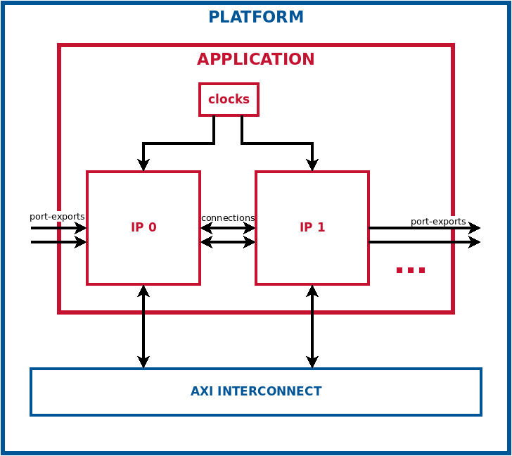
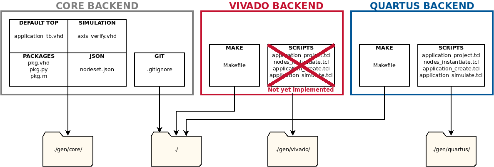
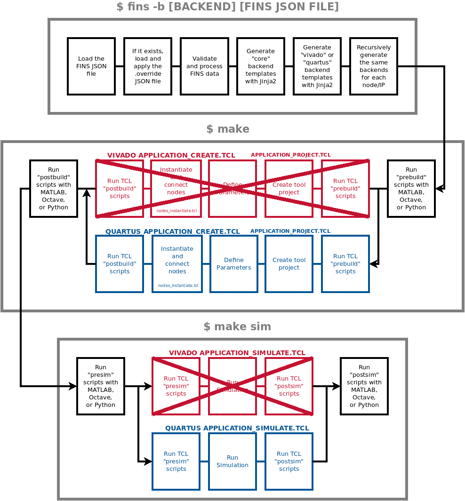

# FINS Application Development

## Introduction

A FINS Application JSON is used to construct a programmable-logic design that instantiates and connects a collection of FINS Nodes. FINS automation creates a simulation testbench for an Application and provides other utilities for rapid Application development.

The diagram below shows a basic FINS Application. There are inter-node connections, exported ports, and exported AXI interfaces. Not shown here are the generated clock domains as well as the modules that connect to the Application's external ports in the platform. The `nodes`, `connections`, `clocks` and `port_exports` fields are detailed in the [FINS Application JSON Schema](#application-json-schema).



For a simple introduction to FINS Applications, follow the [Power Converter Application Tutorial](tutorial2.md).

## Description
The FINS code generation process for Application roughly mirrors that of FINS IPs. FINS takes a JSON specification file as input along with the name of a FINS "backend". Using the information in that JSON file, FINS generates source code, vendor-specific automation scripts, and a JSON file for enabling communication with FINS software. The diagram below shows the templates used in each backend and the output directories of each template set.



> WARNING : At this time, FINS code-generation for Applications is only implemented for the `quartus` backend.

As the diagram above demonstrates, the "core" backend only generates source code and a more detailed JSON specification, while the "quartus" and "vivado" backends generate automation scripts. The "core" backend is automatically executed when either the "vivado" or "quartus" backend is used. To generate the different backends, use the `fins` executable with the `--backend` (`-b`) switch. The code below demonstrates examples of using FINS to generate the different backends.

```bash
# Generates the "core" backend by default
$ fins application.json
# Generates the "core" and "quartus" backends
$ fins -b quartus application.json
```

Within the "core" backend, FINS generates the following:

* **Default Testbench Code:** FINS generates a top-level testbench (**`name`_tb.vhd**). This Application testbench will perform basic port and property verification by default and can optionally be copied and edited by the user.
* **Package Code:** FINS generates an HDL package (**`name`_pkg.vhd**) that contains "parameters" definitions and the record definitions for both "ports" and "properties". FINS also generates simulation-support Python and Octave/MATLAB packages (**`name`_pkg.py**, **`name`_pkg.m**) to automatically update simulation scripts with code generation.
* **Verification Code:** FINS generates a testbench verification module (**`name`_axis_verify.vhd**) for the top-level testbench (**`name`_tb.vhd**) to use to verify ports. FINS Applications cannot have their own properties, but the Application testbench can still perform property verification by leveraging the code generation of each of its IPs (**`name`_axilite_verify.vhd**).

The generated code fits together as shown in the diagram below. The testbench generated by the "core" backend is shown in blue below. The testbench code can optionally be modified by the user. The Application itself (red) is generated by the `quartus` or `vivado` backend. It instantiates and connects Nodes/IPs. 


The "quartus" and "vivado" backends automate the build and simulation of a FINS Application for rapid integration into a platform. The auto-generated TCL scripts are called by the auto-generated **Makefile** with the following targets:

> NOTE: When running the `make` command, you have the option of viewing the console output and watching the GUI-based tools execute the scripts. To use this mode in the IP build and simulation process, set the "UseGui" make variable to 1 like this: `make sim UseGui=1`. Note that in this mode the developer will need to close the GUI-based tool windows to proceed at different steps during the process.

* `all`: (Default) Builds and packages the intellectual property
* `sim`: Runs the simulation, depends on `all` target
* `clean`: Deletes all temporary and project files for this repository only
* `clean-all`: Deletes all temporary and project files for this repository and all node/IP repositories

The following diagram shows the sequence of operations that takes place when running the FINS code generation and then executing the `make` targets.



## Workflow

1. Determine which FINS Nodes will be included, how they will be connected, what clock domains should exist, and which ports should be exported from the Application. Reference [Nodes](#application-json-schema-nodes), [Connections](#application-json-schema-connections) and [Clocks](#application-json-schema-clocks) sections for more information on insantiating nodes and making connections.
2. Add parameters as necessary

Using the information provided by these steps, FINS will generate a block design targeting whichever backend is specified. When targeting the Quartus backend, FINS will generate a Platform Desiginer system that contains any FINS Nodes and connections specified in the Application JSON.

The FINS Application JSON is detailed in a [section below](#application-json-schema), but here are some important notes:
1. Choose a unique and descriptive value for the `name` key.
2. The `is_application` must be set to `true` to flag this JSON as a FINS Application.
3. The `parameters` key contains constants that are propagated throughout the design with code generation, so set values that could potentially change as the design evolves or is adapted. The `parameters` schema is located [here](parameters.md).
4. The `nodes` key lists the FINS Nodes which will make up the Application. To instantiate and connect nodes via JSON see the [Nodes JSON section](#application-json-schema-nodes).
5. The `connections` key defines port connections between Nodes in the Application. To instantiate and connect nodes via JSON see the [Connections JSON section](#application-json-schema-connections).
5. The `clocks` key defines the clock domains of the Application and which ports they are tied to (along with associated resets). A "properties" clock domain is always created by default for any Application with one or more properties interfaces. To create clock domains via JSON see the [Clocks JSON section](#application-json-schema-clocks).
6. The `[hdl_]port_exports` key defines which Node ports should be exported (become the external ports) from the Application. If unset, any unconnected ports are exported from a Application.

The `fins` executable is used with the FINS Application to run code generation. The standard "core" backend location is **./gen/core/**. The `fins` executable automatically detects differences in FINS Application schemas. To generate the Application, execute the following commands:

> NOTE: This example assumes your FINS Application JSON file is called **application.json**.

```bash
$ fins -b quartus application.json
$ make
```

The code generation output will be located in the **./gen/** directory. Browse this directory to notice the files described in the [section above](#applications-description).

## Application JSON Schema

The JSON schema for a FINS Application is composed of the following top-level fields:

| Key               | Type   | Required | Default Value  | Description |
| ----------------- | ------ | -------- | -------------- | ----------- |
| name              | string | YES      |                | The name of the System |
| description       | string | NO       |                | The description of the System |
| version           | string | NO       | 1.0            | The version of the System |
| company_name      | string | NO       |                | The name of the company which created the System |
| company_url       | string | NO       | user.org       | The base URL of the company which created the System. Quartus uses this field as the AUTHOR. |
| company_logo      | string | NO       |                | The relative filepath of the logo image to use for display purposes. |
| license_file      | string | NO       |                | The relative filepath of the license file containing the string to be inserted in all files generated by FINS. |
| is_application    | bool   | YES      | false          | **MUST BE SET TO** `true`. This flags this JSON as a FINS Application JSON file. |
| part              | string | NO       |                | The programmable logic part number. While a default is not selected for the JSON, the auto-generated vendor scripts use the following default parts: Vivado uses the Zynq weback part **xc7z020clg484-1** and Quartus uses the Cyclone V **10CX220YF780I5G**. |
| params            | dict[] | NO       |                | An array of parameter definitions. See the parameters documentation [here](parameters.md). |
| nodes             | dict[] | YES      |                | A dictionary array that contains a description of each node. See [Nodes JSON section](#system-json-schema-nodes). |
| connections       | dict[] | NO       |                | An array of connections between to/from ports of Nodes in the Application. See [Connections JSON section](#application-json-schema-connections). |
| clocks            | dict[] | YES      |                | This field is an array of clock nets. Each entry connects a clock to a list of ports on Nodes in the Application. See [Clocks JSON section](#application-json-schema-clocks). |
| port_exports      | dict[] | NO       | all open ports | An array of ports to export and become the external ports of this Application. By default, unconnected ports are exported. Each dict element contains the "node_name" for the port and the "net" or actual port name. | |
| hdl_port_exports  | dict[] | NO       | all open ports | An array of HDL ports (standard logic [vectors]) to export and become the external ports of this Application. By default, unconnected ports are exported. Each dict element contains the "node_name" for the port and the "net" or actual port name. |
| filesets          | dict   | NO       |                | A dictionary of fileset definitions. "source" files are not permitted for Applications. See the filesets documentation [here](filesets.md). |

An example of a FINS Application JSON file can be found [here](../test/application/application_test.json). Another one is present in the [Power Converter Application Tutorial](tutorial2.md).


## Application JSON Schema: Nodes
Each dictionary element of the `nodes` array has the following fields:

| Key                 | Type              | Required | Default Value | Description |
| ------------------- | ----------------- | -------- | ------------- | ----------- |
| fins_path           | string            | YES      |               | The path to the *generated* FINS Node JSON file of the IP node. |
| module_name         | string            | YES      |               | The name of this module when instantiated in the Block Design. |
| descriptive_node    | bool              | NO       | false         | This Node/IP is a sub-IP or is not a FINS Node and is present only to describe and expose its interfaces and ports to FINS Software. No code/JSON generation should be performed for this Node. |

## Application JSON Schema: Connections
In a FINS Application, a connection can be made from a source port to any number of destinations. Each dictionary element of the `connections` array has the following fields:

| Key                 | Type              | Required | Default Value | Description |
| ------------------- | ----------------- | -------- | ------------- | ----------- |
| source              | dict              | YES      |               | The source port or signal for this connection. This dict contains the "node_name" for the port, the "net" or actual port name, and the "instance" for the instance index if the port has multiple instances. |
| destinations        | dict[]            | YES      |               | The destination ports or signals of this connection. Each dict element contains the "node_name" for the port, the "net" or actual port/signal name, and the "instance" for the instance index if the port has multiple instances. |

### Application JSON Schema: Clocks
In a FINS Application, clock domains must be created and tied to each port in the Application. 
A clock domain named "properties" is always created for any Application that has one or more properties interfaces. Each dictionary element of the `clocks` array has the following fields:

| Key                 | Type              | Required | Default Value | Description |
| ------------------- | ----------------- | -------- | ------------- | ----------- |
| clock               | dict              | YES      |               | The clock domain to create. '_aclk' will be appended to this before being used in HDL. An '_aresetn' will be created and paired with this domain. |
| period_ns           | float             | NO       | 10            | The **simulation-only clock period**. |
| nets                | dict[]            | YES      |               | The list of nets on this clock domain. Each dict element contains the "node_name" for the port and the "net" or actual port name to place on this clock domain. |

**[RETURN TO TOP LEVEL README](../README.md)**
