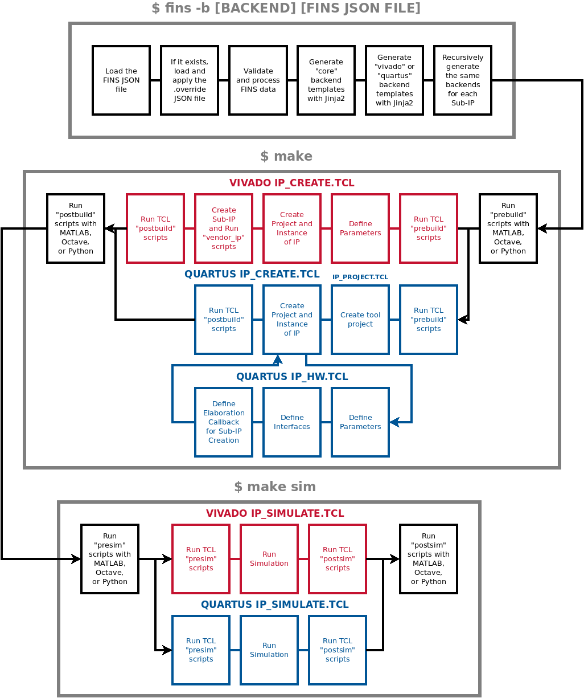

# FINS Node Development

**[RETURN TO TOP LEVEL README](../README.md)**

Fundamentally, FINS is a code generator that uses a Python-processed JSON specification file as its input. Multiple JSON files may be stored for a single IP, each representing a different "configuration" of the IP. For instance, one configuration may set a specific part that is desired for build and/or test. The code generation was built with a plugin architecture using Python setuptools. Each plugin is referenced as a code generator "backend", and this architecture permits additional backends to be added in the future. FINS generates both source code and vendor-specific automation scripts. The diagram below shows the templates used in each backend and the output directories of each template set.


As the diagram above demonstrates, the "core" backend only generates source code while the "quartus" and "vivado" backends generate automation scripts. The "core" backend is automatically executed when either the "vivado" or "quartus" backend is used. To generate the different backends, use the `fins` executable with the `--backend` (`-b`) switch. The code below demonstrates examples of using FINS to generate the different backends.

```bash
# Generates the "core" backend by default
$ fins zynq_no_matlab.json
# Generates the "core" backend explicitly
$ fins --backend core zynq_no_matlab.json
# Generates the "core" and "vivado" backends
$ fins -b vivado zynq_no_matlab.json
# Generates the "core" and "quartus" backends
$ fins -b quartus cycloneV.json
```

By only using the "core" backend, a developer can take advantage of the parameters, properties, and ports code generation of FINS while using their own build and simulation flow. The code generated by the "core" backend is intended to be used with user code that implements a desired function. These pieces fit together as shown in the diagram below.


Within the "core" backend, FINS generates code stubs for both the top-level testbench and the top-level source file. These code stubs give developers a starting point for the top-level design of their IP, and filenames of these code generation outputs are listed below.

* `name`.vhd
* `name`_tb.vhd

To use FINS to its full potential by automating the build and simulation, a developer should first use the "quartus" or "vivado" backends and then execute the `make` command with the following targets:

> NOTE: When running the `make` command, you have the option of viewing the console output and watching the GUI-based tools execute the scripts. To use this mode in the IP build and simulation process, set the "UseGui" make variable to 1 like this: `make sim UseGui=1`. Note that in this mode the developer will need to close the GUI-based tool windows to proceed at different steps during the process.

* `all`: (Default) Builds and packages the intellectual property
* `sim`: Runs the simulation, depends on `all` target
* `clean`: Deletes all temporary and project files for this repository only
* `clean-all`: Deletes all temporary and project files for this repository and all sub-IP repositories

The following diagram shows the sequence of operations that takes place when running the FINS code generation and then executing the `make` targets.



## JSON Schema

The JSON schema for FINS Node is composed of the following top-level fields:

| Key             | Type   | Required | Default Value | Description |
| --------------- | ------ | -------- | ------------- | ----------- |
| name            | string | YES      |               | The name of the IP. |
| description     | string | NO       |               | The description of the IP. |
| version         | string | NO       | 1.0           | The version of the IP. |
| company_name    | string | NO       |               | The name of the company which created the IP. |
| company_url     | string | NO       | user.org      | The base URL of the company which created the IP. Quartus uses this field as the AUTHOR. |
| company_logo    | string | NO       |               | The relative filepath of the logo image to use for display purposes. |
| library         | string | NO       | user          | The name of the category or group of which this IP belongs. |
| user_ip_catalog | string | NO       |               | A directory location where third-party sub-IP is stored, meaning only sub-IP that were not already explicitly referenced in the FINS `ip` key. |
| part            | string | NO       |               | The programmable logic part number. While a default is not selected for the JSON, the auto-generated vendor scripts use the following default parts: Vivado uses the Zynq weback part **xc7z020clg484-1** and Quartus uses the Cyclone V **10CX220YF780I5G**. |
| top_source      | string | NO       | `name`        | The name of the top-level synthesizable source HDL module. For Quartus, this field **MUST** be the same as the top-level source HDL's filename without the extension. |
| top_sim         | string | NO       | `name`_tb     | The name of the top-level testbench simulation HDL module. For Quartus, this field **MUST** be the same as the top-level testbench HDL's filename without the extension. |
| params          | dict[] | NO       |               | An array of parameter definitions. See the parameters documentation [here](parameters.md). |
| filesets        | dict   | NO       |               | A dictionary of fileset definitions. See the filesets documentation [here](filesets.md). |
| ip              | dict[] | NO       |               | An array of sub-IP references. See the sub-IP documentation [here](sub-ip.md). |
| ports           | dict   | NO       |               | A dictionary of ports definitions. See the ports documentation [here](ports.md). |
| properties      | dict   | NO       |               | A dictionary of properties definitions. See the properties documentation [here](properties.md). |

**[RETURN TO TOP LEVEL README](../README.md)**