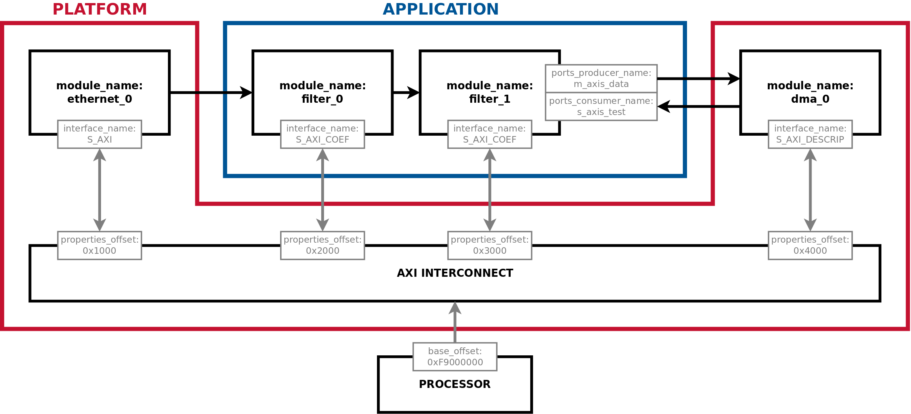

# FINS Nodeset Integration

**[RETURN TO TOP LEVEL README](../README.md)**

## Description

A FINS Nodeset is an integration concept with its own separate JSON schema to describe the collection of FINS Nodes that exist within a programmable logic bitstream. The purpose of creating this file is to aggregate the Node information so that the FINS software package may control properties and communicate with ports in the programmable logic build.

The diagram below is a depiction of a top-level programmable logic block design that gets built into a bitstream. The labeled information is required for software control and data communication with a processor, and this information is defined in the [FINS Nodeset JSON Schema](#json-schema).



## Workflow

The first step in the FINS Nodeset Integration process is the development of an "Application". An Application is a set of connected FINS Nodes composed into a block design. The block design tool is IP Integrator for Xilinx Vivado and Platform Designer for Intel Quartus. Reference the Intel and Xilinx user guides for the step-by-step details of creating new block designs. When instantiating your FINS Nodes within the Application, follow the design rules below:

1. Make sure all FINS Nodes that should be instantiated in your Application are built. This means that `make` is run for each FINS Node.
2. Make sure your design tools are able to find the built FINS Nodes. For Xilinx, add a IP Repository to the IP Catalog. For Intel, modfify the IP search paths in the global settings.
3. Expose (or "export") all AXI4-Lite interfaces at the Application level. This permits vendor AXI Interconnect automation to handle the address space assignments.
4. Expose the Xilinx "generics" or the Intel "parameters" at the Application level for customization when instantiating the Application.

The next step is the integration of the Application with a "Platform". A Platform is a set of HDL code or a block design that is responsible for interacting with the hardware interfaces on the target circuit board. Platforms are often provided by the vendors as reference designs or I/O wrappers. A robust Platform has standard interfaces to interact with an Application.

Once you have a bitstream that integrates an Application and a Platform, you are ready to develop a FINS Nodeset JSON file. The details of the FINS Nodeset JSON schema are in the [section below](#json-schema), but see the notes below for additional help.

1. The `name` key is only use for identification of the nodeset, and it can be set to any descriptive name that is useful.
2. The `base_offset` key is the global offset for the bus that controls the AXI4-Lite Properties interface. For many architectures this is 0, but some specify this base address at the bus level.
3. The `properties_offset` key is the offset for this particular node. It can be set manually or can be set to the filepath of the block design file to auto-infer the offset.
4. `ports_consumer` and `ports_producer` are NOT IMPLEMENTED YET.

The `fins` executable is used with the FINS Nodeset to run code generation. At the Nodeset level, however, the output is only a JSON file that appears at the standard "core" backend location **./gen/core/**. The `fins` executable automatically detects the difference in FINS Node and FINS Nodeset schemas. To generate the Nodeset, execute the following commands:

> NOTE: This example assumes your FINS Nodeset JSON file is called **nodeset.json**.

```bash
$ fins nodeset.json
```

The generated **./gen/core/nodeset.json** file should be copied to the target hardware host with the filepath **/etc/fins/nodeset.json**. This filepath is the default location that the FINS Software package uses for a Nodeset that describes the programmable logic bitstream.

## JSON Schema

A Nodeset has its own schema to enable integration with software. See the table below for the details of all the fields:

| Key         | Type   | Required | Default Value | Description |
| ----------- | ------ | -------- | ------------- | ----------- |
| name        | string | YES      |               | The name of the Nodeset, only used for identification purposes. |
| base_offset | uint   | NO       |             0 | The base address offset of the bus used to communicate with the FINS nodes. |
| nodes       | dict[] | YES      |               | A dictionary array that contains a description of each node. |

Each dictionary element of the `nodes` dictionary array field has the following fields:

| Key               | Type              | Required | Default Value | Description |
| ----------------- | ----------------- | -------- | ------------- | ----------- |
| fins_path         | string            | YES      |               | The path to the *generated* FINS Node JSON file of the IP node. |
| module_name       | string            | YES      |               | If `properties_offset` is a dictionary, this field is used to infer the offset. The name of the instantiated IP in the block design defined above. |
| interface_name    | string            | YES      |               | If `properties_offset` is a dictionary, this field is used to infer the offset. The name of the bus interface used to control and status the properties. |
| properties_offset | uint -OR- string  | YES      |               | The base offset of the address region used to access this node. If a string type, this field is a path to the block design in which the decode of the properties interface is located. This path must end in `.qsys` for Intel Platform Designer or `.bd` for Vivado IP Integrator, and it used to infer the offset. |
| ports_producer    | string            | NO       |               | NOT IMPLEMENTED YET. |
| ports_consumer    | string            | NO       |               | NOT IMPLEMENTED YET. |

## Code Generation

Code generation of a FINS Nodeset JSON file just results in a fully-populated JSON located in the **./gen/core/** directory of where the `fins` executable was run. This generated FINS Nodeset JSON file should be used as an input to the FINS software package.

**[RETURN TO TOP LEVEL README](../README.md)**