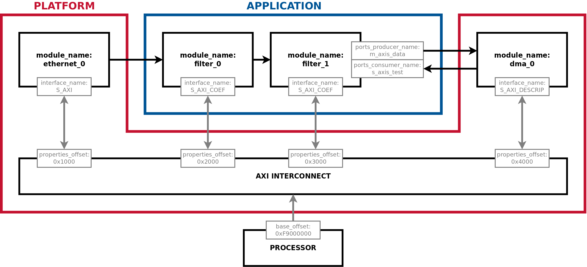

# FINS Integration: Applications and Systems

**[RETURN TO TOP LEVEL README](../README.md)**

Integration in FINS involves two separate steps:
1. [**Application Development**](applications.md): Instantiate and connect FINS Nodes to one another
2. [**System Development**](systems.md): Describe an programmable-logic design's contents for use by FINS-Software

In short, a user will construct a FINS Application comprised of FINS Nodes, and will then integrate this Application into a (often vendor-provided) platform. Once the programmable-logic design is complete, the user will create a FINS System to describe the design's contents and interfaces for use by the FINS software package. Below is an example of a FINS System:

See the following documents for more information:
* [**Application Development**](applications.md)
* [**System Development**](systems.md)

**[RETURN TO TOP LEVEL README](../README.md)**
