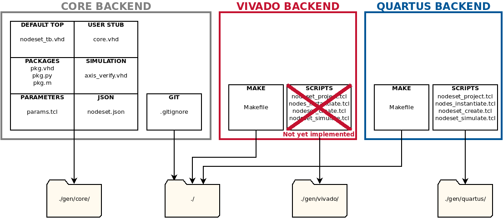
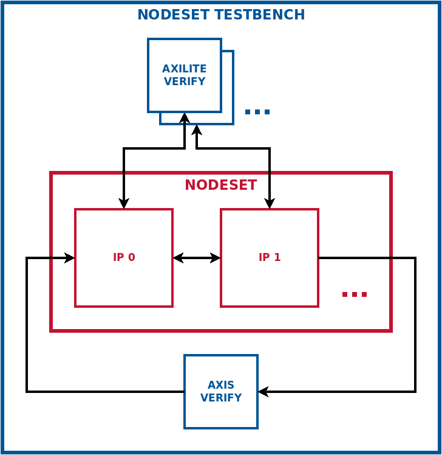
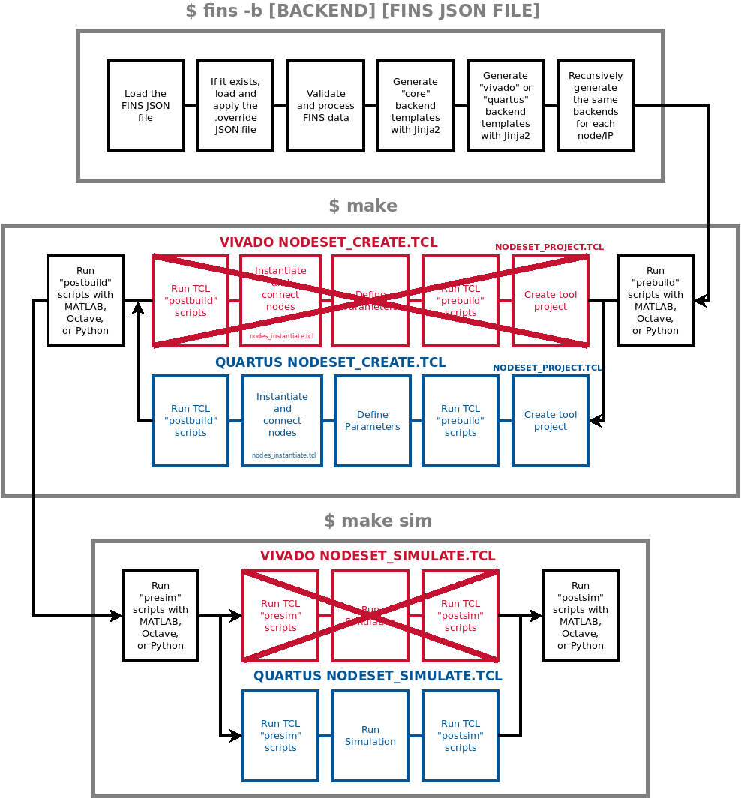

# FINS Nodesets and Integration

**[RETURN TO TOP LEVEL README](../README.md)**

## Introduction

A FINS Nodeset is an integration concept with its own separate JSON schema to describe the collection of FINS Nodes. Via a Nodeset, users can instantiate multiple FINS nodes and make connections between them and/or override their parameters. The FINS Nodeset JSON can also be used to aggregate the Node information so that the FINS software package may control properties and communicate with ports in the programmable logic build.

There are two types of Nodeset: Application-level Nodeset and System-level Nodeset. An Application-level Nodeset is used to construct a design that instantiates and connects FINS Nodes. A System-level Nodeset is used to describe the IPs and interfaces of an existing design and expose that information to software.

The diagram below shows a basic Application-level Nodeset. There are inter-node connections, exported ports, and exported AXI interfaces. Not shown here are the modules that connect to the Nodeset's external ports in the platform. The `nodes`, `port_exports` and `connections` fields are detailed in the [FINS Nodeset JSON Schema](#Nodeset-Json-Schema).


Illustrating the System-level Nodeset construct, the diagram below depicts a programmable logic block design that gets built into a bitstream. A FINS Nodeset is used to describe the design in its entirety. The labeled information is required for software control and data communication with a processor, and this information is defined in the [FINS Nodeset JSON Schema](#Nodeset-Json-Schema).


## Application-level Nodesets

> WARNING : At this time, FINS code-generation for Application-level Nodesets is only implemented for the `quartus` backend.

### Application-level Nodesets: Description
The FINS code generation process for Application-level Nodesets roughly mirrors that of FINS IPs. FINS takes a JSON specification file as input along with the name of a FINS "backend". Using the information in that JSON file, FINS generates source code, vendor-specific automation scripts, and a JSON file for enabling communication with FINS software. The diagram below shows the templates used in each backend and the output directories of each template set.



As the diagram above demonstrates, the "core" backend only generates source code and a more detailed JSON specification, while the "quartus" and "vivado" backends generate automation scripts. The "core" backend is automatically executed when either the "vivado" or "quartus" backend is used. To generate the different backends, use the `fins` executable with the `--backend` (`-b`) switch. The code below demonstrates examples of using FINS to generate the different backends.

```bash
# Generates the "core" backend by default
$ fins nodeset.json
# Generates the "core" and "quartus" backends
$ fins -b quartus nodeset.json
```

Within the "core" backend, FINS generates the following:

* **Default Testbench Code:** FINS generates a top-level testbench (**`name`_tb.vhd**). This Nodeset testbench will perform basic port and property verification by default and can optionally be copied and edited by the user.
* **(_NOT YET IMPLEMENTED_) Package Code:** FINS generates an HDL package (**`name`_pkg.vhd**) that contains "parameters" definitions and the record definitions for both "ports" and "properties". FINS also generates simulation-support Python and Octave/MATLAB packages (**`name`_pkg.py**, **`name`_pkg.m**) to automatically update simulation scripts with code generation.
* **Verification Code:** FINS generates a testbench verification module (**`name`_axis_verify.vhd**) for the top-level testbench (**`name`_tb.vhd**) to use to verify ports. Nodesets cannot have their own properties, but the Nodeset testbench can still perform property verification by leveraging the code generation of each the Nodeset's IPs (**`name`_axilite_verify.vhd**).

The generated code fits together as shown in the diagram below. The testbench generated by the "core" backend is shown in blue below. The testbench code can optionally be modified by the user. The Nodeset itself (red) is generated by the `quartus` or `vivado` backend. It instantiates and connects Nodes/IPs. 



The "quartus" and "vivado" backends automate the build and simulation of a FINS Application-level Nodeset for rapid integration into a platform. The auto-generated TCL scripts are called by the auto-generated **Makefile** with the following targets:

> NOTE: When running the `make` command, you have the option of viewing the console output and watching the GUI-based tools execute the scripts. To use this mode in the IP build and simulation process, set the "UseGui" make variable to 1 like this: `make sim UseGui=1`. Note that in this mode the developer will need to close the GUI-based tool windows to proceed at different steps during the process.

* `all`: (Default) Builds and packages the intellectual property
* `sim`: Runs the simulation, depends on `all` target
* `clean`: Deletes all temporary and project files for this repository only
* `clean-all`: Deletes all temporary and project files for this repository and all node/IP repositories

The following diagram shows the sequence of operations that takes place when running the FINS code generation and then executing the `make` targets.



### Application-level Nodesets: Workflow

1. Determine which FINS Nodes will be included, how they will be connected, and which ports should be exported from the Nodeset. Reference [Nodes](#Nodeset-Json-Schema:-Nodes) and [Connections](#Nodeset-Json-Schema:-Connections) sections for more information on insantiating nodes and making connections.
2. Add parameters as necessary

Using the information provided by these steps, FINS will generate a block design targeting whichever backend is specified. When targeting the Quartus backend, FINS will generate a Platform Desiginer system that contains any FINS Nodes and connections specified in the Nodeset JSON.

The FINS Nodeset JSON is detailed in a [section below](#Nodeset-Json-Schema), but here are some important notes:
1. Choose a unique and descriptive value for the `name` key.
2. The `parameters` key contains constants that are propagated throughout the design with code generation, so set values that could potentially change as the design evolves or is adapted. The `parameters` schema is located [here](parameters.md).
3. The `nodes` key lists the FINS Nodes which will make up the Nodeset. To instantiate and connect nodes via JSON see the [Nodes JSON section](#Nodeset-Json-Schema:-Nodes).
4. The `connections` key defines port connections between Nodes in the Nodeset. To instantiate and connect nodes via JSON see the [Connections JSON section](#Nodeset-Json-Schema:-Connections).
5. The `[hdl_]port_exports` key defines which Node ports should be exported (become the external ports) from the Nodeset. If unset, all unconnected ports are exported from a Nodeset.

The `fins` executable is used with the FINS Nodeset to run code generation. The standard "core" backend location is **./gen/core/**. The `fins` executable automatically detects differences in FINS Nodeset schemas. To generate the Application-level Nodeset, execute the following commands:

> NOTE: This example assumes your FINS Nodeset JSON file is called **nodeset.json**.

```bash
$ fins -b quartus nodeset.json
$ make
```

The code generation output will be located in the **./gen/** directory. Browse this directory to notice the files described in the [section above](#Application-level-Nodesets:-Description).

## System-level Nodesets
### System-level Nodesets: Description

FINS does _not_ generate HDL a block design for System-level Nodesets. System-level Nodesets are used to describe and expose the contents of an existing FPGA design to enable software communication to properties and ports. In particular, a System-level Nodeset generally describes the contents of an FPGA block design or HDL design. The block design tool is IP Integrator for Xilinx Vivado and Platform Designer for Intel Quartus. Reference the Intel and Xilinx user guides for the step-by-step details of creating new block designs.

More explicitly, System-level Nodesets tell software what address offsets to use for each IP/Node in the FPGA design. Additionally, they inform software as to which ports in the design communicate data to/from the processor via DMA. The important file generated by FINS for a System-level Nodeset is **./gen/core/nodeset.json**. This generated JSON file is used by FINS Software to ascertain important information about the contents of a bitstream.

### System-level Nodesets: Workflow

The first step in developing a System-level Nodeset is to integrate any application-level code with a "Platform". A Platform is a set of HDL code or a block design that is responsible for interacting with the hardware interfaces on the target circuit board. Platforms are often provided by the vendors as reference designs or I/O wrappers. A robust Platform has standard interfaces to interact with application-level modules.

Once you have a bitstream that integrates application-level content with a Platform, you are ready to develop a FINS System-level Nodeset JSON file. The details of the FINS Nodeset JSON schema are in the [section below](#Nodeset-JSON-Schema).

To get started developing a System-level Nodeset, create a Nodeset JSON with the following:

1. A unique and descriptive value for the `name` key.
2. The `is_system_nodeset` must be set to `true` to flag this Nodeset as System-level.
3. The `parameters` key contains constants that can be used elsewhere in the JSON file. The `parameters` schema is located [here](parameters.md).
4. The `nodes` key lists the IPs and Nodes which are being described by this Nodeset. See the [Nodes JSON section](#Nodeset-Json-Schema:-Nodes) for more information.
5. The `base_offset` key is the global offset for the bus that controls the AXI4-Lite Properties interface. For many architectures this is 0, but some specify this base address at the bus level.
6. The `properties_offset` key is the offset for a particular node in the `nodes` array. It can be set manually or can be set to the filepath of the block design file to auto-infer the offset.
7. The `ports_consumer_name` key is set for the element of the `nodes` array that consumes data from a processor through a DMA module. At most one element of the `nodes` array can have this key set.
8. The `ports_producer_name` key is set for the element of the `nodes` array that produces data to a processor through a DMA module. At most one element of the `nodes` array can have this key set.

The `fins` executable is used with the FINS Nodeset to run code generation. The standard "core" backend location is **./gen/core/**. The `fins` executable automatically detects differences in FINS Nodeset schemas. To generate the System-level Nodeset, execute the following commands:

> NOTE: This example assumes your FINS Nodeset JSON file is called **nodeset.json**.

```bash
$ fins nodeset.json
```

The generated **./gen/core/nodeset.json** file should be copied to the target hardware host with the filepath **/etc/fins/nodeset.json**. This filepath is the default location that the FINS Software package uses for a Nodeset that describes the programmable logic bitstream.

## Nodeset JSON Schema

Fields are flagged as being for an Application-level Nodeset, System-level Nodeset, or both via the "Mode" column.
 
The JSON schema for a FINS Nodeset is composed of the following top-level fields:

| Key              | Type   | Mode | Required | Default Value | Description |
| ---------------- | ------ | ---- | -------- | ------------- | ----------- |
| name             | string | BOTH | YES      |               | The name of the Nodeset |
| description      | string | BOTH | NO       |               | The description of the Nodeset |
| version          | string | BOTH | NO       | 1.0           | The version of the Nodeset |
| company_name     | string | BOTH | NO       |               | The name of the company which created the Nodeset |
| company_url      | string | BOTH | NO       | user.org      | The base URL of the company which created the Nodeset. Quartus uses this field as the AUTHOR. |
| company_logo     | string | APP  | NO       |               | The relative filepath of the logo image to use for display purposes. |
| part             | string | APP  | NO       |               | The programmable logic part number. While a default is not selected for the JSON, the auto-generated vendor scripts use the following default parts: Vivado uses the Zynq weback part **xc7z020clg484-1** and Quartus uses the Cyclone V **10CX220YF780I5G**. |
| is_system_level  | bool   | SYS  | YES      |         false | The base address offset oilef the bus used to communicate with the FINS nodes. |
| base_offset      | uint   | SYS  | NO       |             0 | The base address offset oilef the bus used to communicate with the FINS nodes. |
| params           | dict[] | BOTH | NO       |               | An array of parameter definitions. See the parameters documentation [here](parameters.md). |
| nodes            | dict[] | BOTH | YES      |               | A dictionary array that contains a description of each node. See [Nodes JSON section](#Nodeset-Json-Schema:-Nodes). |
| connections      | dict[] | APP  | NO       |               | An array of connections between to/from ports of Nodes in the Nodeset. See [Connections JSON section](#Nodeset-Json-Schema:-Connections). |
| port_exports     | dict[] | APP  | NO       | open ports    | An array of ports to export and become the external ports of this Nodeset. Each dict element contains the "node_name" for the port and the "net" or actual port name. | |
| hdl_port_exports | dict[] | APP  | NO       | open ports    | An array of HDL ports (standard logic [vectors]) to export and become the external ports of this Nodeset. Each dict element contains the "node_name" for the port and the "net" or actual port name. |
| filesets         | dict   | APP  | NO       |               | A dictionary of fileset definitions. See the filesets documentation [here](filesets.md). |


### Nodeset JSON Schema: Nodes
Each dictionary element of the `nodes` array has the following fields:

| Key                 | Type              | Mode | Required | Default Value | Description |
| ------------------- | ----------------- | ---- | -------- | ------------- | ----------- |
| fins_path           | string            | BOTH | YES      |               | The path to the *generated* FINS Node JSON file of the IP node. |
| module_name         | string            | BOTH | YES      |               | The name of this module when instantiated in the Block Design. |
| interface_name      | string            | BOTH | NO       |               | The unique name given to this module's property offset to reference it externally (in testbench and from software). This field is required if the node has a properties interface. |
| descriptive_node    | bool              | APP  | NO       | false         | This Node/IP is not a FINS Node and is present only to describe and expose its interfaces and ports to FINS Software. No code/JSON generation should be performed for this Node. |
| properties_offset   | uint -OR- string  | SYS  | YES      |               | The base offset of the address region used to access this node. If a string type, this field is a path to the block design in which the decode of the properties interface is located. This path must end in `.qsys` for Intel Platform Designer or `.bd` for Vivado IP Integrator, and it used to infer the offset. |
| ports_producer_name | string            | SYS  | NO       |               | The name of the AXI4-Stream bus interface that sends data to the processor through a DMA module. |
| ports_consumer_name | string            | SYS  | NO       |               | The name of the AXI4-Stream bus interface that receives data from the processor through a DMA module. |

### Nodeset JSON Schema: Connections
In a FINS Application-level Nodeset, a connection can be made from a source port to any number of destinations. Each dictionary element of the `connections` array has the following fields:

| Key                 | Type              | Mode | Required | Default Value | Description |
| ------------------- | ----------------- | ---- | -------- | ------------- | ----------- |
| source              | dict              | APP  | YES      |               | The source port or signal for this connection. This dict contains the "node_name" for the port/signal and the "net" or actual port/signal name. |
| destinations        | dict[]            | APP  | YES      |               | The destination ports or signals of this connection. Each dict element contains the "node_name" for the port/signal and the "net" or actual port/signal name. |

**[RETURN TO TOP LEVEL README](../README.md)**
