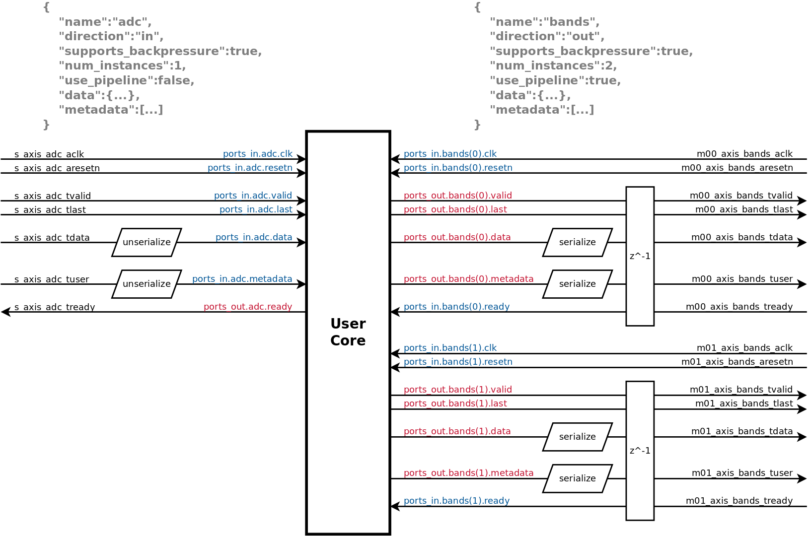

# FINS Node Ports

**[RETURN TO TOP LEVEL README](../README.md)**

Ports are a way to standardize data and metadata communication within the programmable logic. FINS generates an AXI4-Stream bus interpreter module which transmits data and metadata in parallel through the AXI4-Stream TDATA and TUSER fields, respectively.

## JSON Schema

The top-level `ports` field of the FINS Node JSON Schema in turn has a single `ports` field. See the table below for the details of this single field:

> NOTE: In the tables below, `param['name']` is used for "Type" for some fields. This indicates that a string containing the name of a FINS parameter can be used in place of the value. However, ensure the FINS parameter has the same type as expected by the field!

| Key   | Type   | Required | Default Value | Description |
| ----- | ------ | -------- | ------------- | ----------- |
| ports | dict[] | YES      |               | An array of port definitions. See below for more information on the schema for each element of the array. |

Each dictionary element of the `ports` dictionary array field has the following fields:

> NOTES: Each element within the `ports` dictionary array must have a unique `name` field. While neither `data` nor `metadata` are required in the table below, at least one must be used.

| Key                  | Type                    | Required | Default Value | Value Restrictions | Description |
| -------------------- | ----------------------- | -------- | ------------- | ------------------ | ----------- |
| name                 | string                  | YES      |               |                    | The name of the port. This must be unique within a FINS IP. |
| direction            | string                  | YES      |               | in<br />out        | The bus direction of the port. This generally corresponds to the HDL port direction - except for the "tready" signal. |
| supports_backpressue | bool or `param['name']` | NO       | false         |                    | A flag indicating if the port supports backpressure. Backpressure manifests as the "tready" signal of the AXI4-Stream bus. |
| num_instances        | uint or `param['name']` | NO       | 1             | >=1                | The number of instances of this port. Each instance is independent and has unique control signals. |
| use_pipeline         | bool or `param['name']` | NO       | true          |                    | A flag indicating if a pipeline should be inserted in the port. If true, input and output ports will have a 1 clock latency. |
| data                 | dict or `param['name']` | YES      |               |                    | A dictionary the describes the data characteristics. This dictionary determines how the bus interpreter module decodes the "tdata" signal of the AXI4-Stream bus. |
| metadata             | dict[]                  | NO       |               |                    | An array of dictionaries that define metadata. This array of dictionaries determines how the bus interpreter module decodes the "tuser" signal of the AXI4-Stream bus. |

The `data` dictionary field has the following fields:

| Key          | Type                    | Required | Default Value | Value Restrictions    | Description |
| ------------ | ----------------------- | -------- | ------------- | --------------------- | ----------- |
| bit_width    | uint or `param['name']` | NO       | 16            | >= 8, <= 4096<b>*</b> | The bit width of a single sample of data. If `is_complex` is true, then this value is the bit width for BOTH real and imaginary components. Since this value is for a single sample, it should not change when `num_samples` or `num_channels` change. |
| is_complex   | bool or `param['name']` | NO       | false         |                       | A flag indicating if a sample of data has real and imaginary parts. The real and imaginary parts MUST have the same bit width, and their summed bit widths should be put in the `bit_width` field. If this value is true, then real data is packed in the LSBs of the sample. |
| is_signed    | bool or `param['name']` | NO       | false         |                       | A flag indicating if a sample of data is interpreted as a signed 2's complement value; otherwise, it is interpreted as an unsigned value. This value applies to the individual real and imaginary components when `is_complex` is true. |
| num_samples  | uint or `param['name']` | NO       | 1             | >= 1                  | The number of simultaneous samples that are communicated through the data bus per transaction for a single channel. When `num_samples` is > 1, the first sample is packed in the LSBs and the last sample is packed in the MSBs. |
| num_channels | uint or `param['name']` | NO       | 1             | >= 1                  | The number of parallel channels that are communicated through the data bus. When `num_channels` is > 1, the first channel is packed in the LSBs and the last channel is packed in the MSBs.  |

> **\*** The maximum `bit_width` for `num_samples`=1 and `num_channels`=1 is 4096. The maximum `bit_width` is divided by the `num_samples` and/or `num_channels` since the total data width is capped at 4096. For example, when `num_samples`=2 and `num_channels`=4, the maximum `bit_width` is 4096/2/4=512.

Each dictionary element of the `metadata` dictionary array field has the following fields:

> NOTE: Each element within the `metadata` dictionary array must have a unique `name` field.

| Key          | Type                    | Required | Default Value | Value Restrictions | Description |
| ------------ | ----------------------- | -------- | ------------- | ------------------ | ----------- |
| name         | string                  | YES      |               |                    | The name of the metadata. This must be unique within a port. |
| bit_width    | uint or `param['name']` | NO       | 16            | >= 1<b>*</b>       | The bit width of the metadata. If `is_complex` is true, then this value is the bit width for BOTH real and imaginary components. |
| is_complex   | bool or `param['name']` | NO       | false         |                    | A flag indicating if the metadata has real and imaginary parts. The real and imaginary parts MUST have the same bit width, and their summed bit widths should be put in the `bit_width` field. If this value is true, then real data is packed in the LSBs of the sample. |
| is_signed    | bool or `param['name']` | NO       | false         |                    | A flag indicating if the metadata is interpreted as a signed 2's complement value; otherwise, it is interpreted as an unsigned value. This value applies to the individual real and imaginary components when `is_complex` is true. |

> **\*** The `bit_width` for all metadata fields must sum to <= 4096.

## Ports Records

Ports in a FINS Node JSON file autogenerate into an intepreter module that uses records defined in the VHDL package file. This module interacts with user HDL through the `ports_in` and `ports_out` record interfaces which are defined in the auto-generated VHDL package file. `ports_in` contains the signals that go from the bus interpreter decode module to user HDL, and `ports_out` contains the signals that go from user HDL to the bus interpreter decode module. These top-level records are an array if `num_instances > 1`, and they have a field for each property that can interact with other HDL. Each port in turn has fields that specify the interface with the user HDL. The fields of each port record depend on the direction and if backpressure is supported. The table below shows all available combinations:

| `direction` | `supports_backpressure` | `data` exists | `metadata` exists | ports_in Record Fields                                       | ports_out Record Fields                 |
| ----------- | ----------------------- | ------------- | ----------------- | ------------------------------------------------------------ | --------------------------------------- |
| in          | true                    | true          | false             | clk<br />resetn<br />valid<br />last<br />data               | ready                                   |
| in          | true                    | false         | true              | clk<br />resetn<br />valid<br />last<br />metadata           | ready                                   |
| in          | true                    | true          | true              | clk<br />resetn<br />valid<br />last<br />data<br />metadata | ready                                   |
| in          | false                   | true          | false             | clk<br />resetn<br />valid<br />last<br />data               |                                         |
| in          | false                   | false         | true              | clk<br />resetn<br />valid<br />last<br />metadata           |                                         |
| in          | false                   | true          | true              | clk<br />resetn<br />valid<br />last<br />data<br />metadata |                                         |
| out         | true                    | true          | false             | clk<br />resetn<br />ready                                   | valid<br />last<br />data               |
| out         | true                    | false         | true              | clk<br />resetn<br />ready                                   | valid<br />last<br />metadata           |
| out         | true                    | true          | true              | clk<br />resetn<br />ready                                   | valid<br />last<br />data<br />metadata |
| out         | false                   | true          | false             | clk<br />resetn                                              | valid<br />last<br />data               |
| out         | false                   | false         | true              | clk<br />resetn                                              | valid<br />last<br />metadata           |
| out         | false                   | true          | true              | clk<br />resetn                                              | valid<br />last<br />data<br />metadata |

The diagram below has a visual representation of how example ports are converted to Port records from AXI4-Stream buses:



The type of the "data" field of `ports_in` and `ports_out` records depends on the characteristics of the data definition. The table below shows the possible combinations of data types.

| `num_channels` | `num_samples` | `is_complex` | `is_signed` | Data Type                                           |
| -------------- | ------------- | ------------ | ----------- | --------------------------------------------------- |
| 1              | 1             | false        | false       | unsigned                                            |
| 1              | 1             | false        | true        | signed                                              |
| 1              | 1             | true         | false       | record(i:unsigned, q:unsigned)                      |
| 1              | 1             | true         | true        | record(i:signed, q:signed)                          |
| 1              | > 1           | false        | false       | samples[] unsigned                                  |
| 1              | > 1           | false        | true        | samples[] signed                                    |
| 1              | > 1           | true         | false       | samples[] record(i:unsigned, q:unsigned)            |
| 1              | > 1           | true         | true        | samples[] record(i:signed, q:signed)                |
| > 1            | 1             | false        | false       | channels[] unsigned                                 |
| > 1            | 1             | false        | true        | channels[] signed                                   |
| > 1            | 1             | true         | false       | channels[] record(i:unsigned, q:unsigned)           |
| > 1            | 1             | true         | true        | channels[] record(i:signed, q:signed)               |
| > 1            | > 1           | false        | false       | channels[] samples[] unsigned                       |
| > 1            | > 1           | false        | true        | channels[] samples[] signed                         |
| > 1            | > 1           | true         | false       | channels[] samples[] record(i:unsigned, q:unsigned) |
| > 1            | > 1           | true         | true        | channels[] samples[] record(i:signed, q:signed)     |

The type of the "metadata" field of `ports_in` and `ports_out` records depends on the characteristics of the metadata definition. The `metadata` record itself contains fields that have the names of each metadata field. The combinations of different types of each metafield is shown in the table below.

| `is_complex` | `is_signed` | Metadata Type                  |
| ------------ | ----------- | ------------------------------ |
| false        | false       | unsigned                       |
| false        | true        | signed                         |
| true         | false       | record(i:unsigned, q:unsigned) |
| true         | true        | record(i:signed, q:signed)     |

## Code Generation

Code generation is performed in two steps. The ports schema is analyzed and populated with default values and additional fields, and then the transformed schema is passed to Jinja2 templates for code generation. When the `ports` top-level field exists in the FINS Node JSON file, the following output files are generated:

### `name`_pkg.vhd

This VHDL package defines the ports records and their associated signals. This package is used by the bus interpreter decode modules.

For ease of use, four conversion functions are provided in the pkg file for each port's data and metadata. These functions convert between the custom record types and std_logic_vector's, and their naming conventions are listed below:

* f_serialize_[IP_NAME]_[PORT_NAME]_data()
* f_unserialize_[IP_NAME]_[PORT_NAME]_data()
* f_serialize_[IP_NAME]_[PORT_NAME]_metadata()
* f_unserialize_[IP_NAME]_[PORT_NAME]_metadata()

### `name`_axis.vhd

This VHDL module decodes data and metadata communication on the AXI4-Stream bus into record signals for each port.

### `name`_axis_verify.vhd

This VHDL module defines file IO processes for sourcing and sinking data/metadata between text files and the test bench. The file paths of these text files are generics for the module, and they are relative to where the simulation is executed within the vendor tools. The table below has a listing of the execution directories and relative file paths from the FINS simulation execution directory back to the root of the IP.

| Vendor Tool    | Version | Execution Directory                        | Relative Path      |
| -------------- | ------- | ------------------------------------------ | ------------------ |
| Xilinx Vivado  | 2019.1  | project/vivado/`name`.sim/sim_1/behav/xsim | ../../../../../../ |
| Intel ModelSim | 19.1    | project/quartus/mentor                     | ../../../          |

The source and sink text files require a specific format for file IO processes to be able to read the information properly. The following rules apply to these simulation sink/source files.

1. All information in the text file is represented in ASCII hex characters.
2. Each AXI4-Stream transaction is a row within the text file.
3. Each transaction (row) is space-separated to differentiate between TLAST, TUSER, and TDATA fields.
4. Each transaction is required to start with a single hex character that represents the TLAST field of the AXI4-Stream bus protocol.
5. After the TLAST field, the transaction row contains the TDATA field.
6. If there is metadata communicated through the port, the TUSER field is present after the TDATA field in the transaction row.

An example of a simulation source file for a port that has both data (TDATA) and metadata (TUSER) is below. This example contains two AXI4-Stream packets, each with 4 transactions.

```
0 0000 00010001
0 0101 00010001
0 0202 00010001
1 0303 00010001
0 0404 00010001
0 0505 00010001
0 0606 00010001
1 0707 00010001
```

**[RETURN TO TOP LEVEL README](../README.md)**
