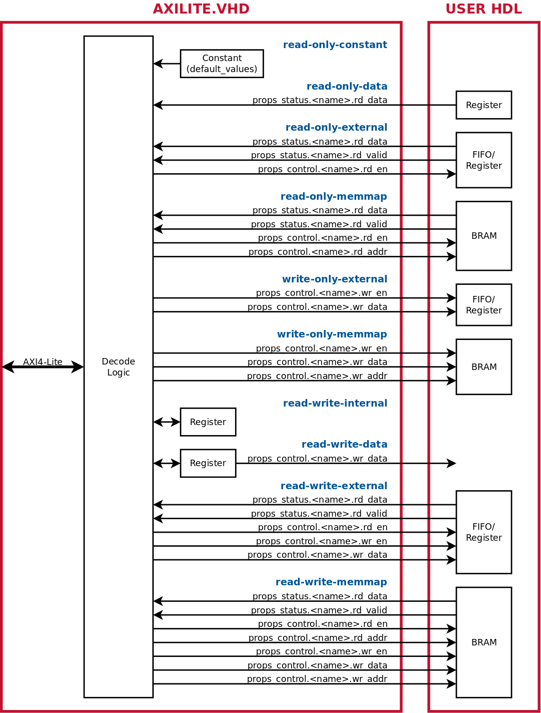
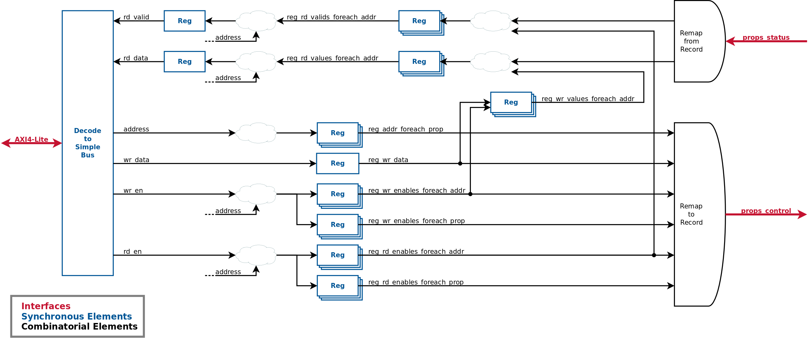

# FINS Node Properties

**[RETURN TO TOP LEVEL README](../README.md)**

Properties are a way to describe software-controllable registers within the programmable logic. FINS provides code generation of decode modules for different memory-mapped bus architectures so that a CPU can control these properties in a repeatable way.

## JSON Schema

The top-level `properties` field of the FINS Node JSON Schema in turn has several fields. Most of these child fields define the underlying memory-mapped bus, but the last child field contains the properties definitions. See the table below for the details of all the fields:

> NOTE: In the tables below, `param['name']` is used for "Type" for some fields. This indicates that a string containing the name of a FINS parameter can be used in place of the value. However, ensure the FINS parameter has the same type as expected by the field!

| Key                  | Type                    | Required | Default Value | Description |
| -------------------- | ----------------------- | -------- | ------------- | ----------- |
| addr_width           | uint or `param['name']` | YES      |               | The address width of the underlying memory-mapped bus. |
| data_width           | uint or `param['name']` | YES      |               | The data width of the underlying memory-mapped bus. This setting also determines the default bit width of each property. The maximum value for this setting is currently 128, but it should be set appropriately for the underlying bus architecture. |
| is_addr_byte_indexed | bool or `param['name']` | NO       | True          | A boolean that determines if each increment by 1 of the address corresponds to a byte or to a word (a word is the full `data_width`). By default, Vivado's AXI interconnect is byte indexed and Quartus' AXI interconnect is word indexed. |
| properties           | dict[]                  | YES      |               | An array of property definitions. See below for more information on the schema for each element of the array. |

Each dictionary element of the `properties` dictionary array field has the following fields:

> NOTE: Each element within the `properties` dictionary array must have a unique `name` field.

| Key            | Type                      | Required | Default Value | Value Restrictions           | Description |
| -------------- | ------------------------- | -------- | ------------- | ---------------------------- | ----------- |
| name           | string                    | YES      |               |                              | The name of the register. It must be unique from other registers within the IP. |
| type           | string                    | YES      |               | read-only-constant read-only-data read-only-external read-only-memmap write-only-external write-only-memmap read-write-internal read-write-data read-write-external read-write-memmap | The type of the property. The enumerations of the property are described in detail in the "Property Records" section below. |
| description    | string                    | NO       | ""            |                              | The description of the register. It should contain information about how to use the register and any limitations. |
| width          | uint or `param['name']`   | NO       | `data_width`  | 1 to `data_width`            | The number of bits used to represent the property. If `width` is less than `data_width`, the bits of the property are physically located in the LSBs of the `data_width` register. |
| length         | uint or `param['name']`   | NO       | 1             | 1 to Available Address Space | The number of addresses to use for this property. When `length` is greater than 1, the property is considered a "sequence" property. Each item of the sequence is identical in definition and is represented by a single address. |
| default_values | uint[] or `param['name']` | NO       | 0             | 0 to 2^`data_width`-1        | The default setting after power-on or reset. The length of this array MUST match the `length` key. |
| disable_default_test | bool or `param['name']` | NO   | False         | True False | Flag to determine whether or not the default values should be tested as part of the simulation testbench verification (i.e. `axilite_verify`). |
| range_min      | uint or `param['name']`   | NO       | 0             | 0 to 2^`data_width`-1        | The minimum value of the register. This setting is unused in the firmware code but is used in the software to not set invalid values in the firmware. |
| range_max      | uint or `param['name']`   | NO       | 2^(`width`)-1 | 0 to 2^`data_width`-1        | The maximum value of the register. This setting is unused in the firmware code but is used in the software to not set invalid values in the firmware. |
| is_signed      | bool or `param['name']`   | NO       | false         | false ONLY                   | [NOT IMPLEMENTED] A flag indicating if the register is signed. |

## Property Records

Properties in a FINS Node JSON file autogenerate into a decode module that uses records defined in the VHDL package file. This module interacts with user HDL through the `props_control` and `props_status` record interfaces which are defined in the auto-generated VHDL package file. `props_control` contains the signals that go from the memory-mapped bus decode module to user HDL, and `props_status` contains the signals that go from user HDL to the memory-mapped bus decode module. These top-level records have a field for each property that can interact with other HDL (all but the `read-only-constant` and `read-write-internal` property types). Each property in turn has fields that specify the interface with the user HDL. The accessibility of the property and the fields of the records are set based on the type. The table below has additional information on the property types and the available fields for each type.

| type                | props_control Record Fields                             | props_status Record Fields | Description |
| ------------------- | --------------------------------------------------------| -------------------------- | ----------- |
| read-only-constant  | None                                                    | None                       | Read-only constant property. A read of this property will only return the value set in the `default_values` field. Example usage: Version code, address space alignment null property. |
| read-only-data      | None                                                    | rd_data                    | Read-only data property. This property is used to read the value of non-interactive data that is immediately available. Example usage: Status bits, status counters. |
| read-only-external  | rd_en                                                   | rd_data rd_valid      | Read-only external property. This property is used to read the value of interactive elements where data must be retrieved with control signals. Example usage: FIFO read. |
| read-only-memmap    | rd_en rd_addr                                      | rd_data rd_valid      | Read-only memory mapped property. This property is used to read the value of interactive elements where data must be retrieved using an address. Example usage: BRAM read. |
| write-only-external | wr_en wr_data                                      | None                       | Write-only external property. This property is used to write the value of interactive elements where data must be set with control signals. The write enable may also be used by itself as an activation strobe. Example usage: FIFO write, dynamic control register write, processing start strobe. |
| write-only-memmap   | wr_en wr_data wr_addr                         | None                       | Write-only memory mapped property. This property is used to write the value of interactive elements where data must be set using an address. Example usage: BRAM write. |
| read-write-internal | None                                                    | None                       | Readable and writable internal property. This property can ONLY be accessed by software and is used for bus testing. Example usage: Loopback register for bus verification. |
| read-write-data     | wr_data                                                 | None                       | Readable and writable data property. This property is used to read and write static data that is available for use in the HDL design. Example usage: Static control register, Enable register. |
| read-write-external | rd_en wr_en wr_data                           | rd_data rd_valid      | Readable and writable external property. This property is used to read and write the value of interactive elements where data must be retrieved and set with control signals. Example usage: FIFO read/write, dynamic control register read/write. |
| read-write-memmap   | rd_en rd_addr wr_en wr_data wr_addr | rd_data rd_valid      | Readable and writable memory mapped property. This property is used to read and write the value of interactive elements where data must be retrieved and set using an address. Example usage: BRAM read/write. |

A visualization of the property records generated by the different types is located in the diagram below.

## Code Generation

Code generation is performed in two steps. The properties schema is analyzed and populated with default values and additional fields, and then the transformed schema is passed to Jinja2 templates for code generation. When the `properties` top-level field exists in the FINS Node JSON file, the following output files are generated:

### `name`_pkg.vhd

This VHDL package defines the property records and their associated signals. This package is used by the memory-mapped bus decode modules.

### `name`_axilite.vhd

This VHDL module decodes reads/writes on the AXI4-Lite bus into record signals for each property. This is the preferred bus interface for properties. The diagram below contains the architecture of the AXI4-Lite memory-mapped bus decode module.

### `name`_axilite_verify.vhd

This VHDL package defines testbench procedures for reading/writing individual properties in simulation and includes a procedure that verifies all the properties and their desired characteristics. These procedures are listed in the table below:

| Procedure             | Arguments | Usage |
| --------------------- | --------- | ----- |
| `name`_axilite_verify | S_AXI_ACLK    S_AXI_ARESETN S_AXI_AWADDR  S_AXI_AWPROT  S_AXI_AWVALID S_AXI_AWREADY S_AXI_WDATA   S_AXI_WSTRB   S_AXI_WVALID  S_AXI_WREADY  S_AXI_BRESP   S_AXI_BVALID  S_AXI_BREADY  S_AXI_ARADDR  S_AXI_ARPROT  S_AXI_ARVALID S_AXI_ARREADY S_AXI_RDATA   S_AXI_RRESP   S_AXI_RVALID  S_AXI_RREADY   | This procedure verifies all properties of the IP by checking default values, write widths, and the bad address error code. |
| `name`_write_reg      | reg_wr_address reg_wr_data    S_AXI_ACLK     S_AXI_ARESETN  S_AXI_AWADDR   S_AXI_AWPROT   S_AXI_AWVALID  S_AXI_AWREADY  S_AXI_WDATA    S_AXI_WSTRB    S_AXI_WVALID   S_AXI_WREADY   S_AXI_BRESP    S_AXI_BVALID   S_AXI_BREADY   S_AXI_ARADDR   S_AXI_ARPROT   S_AXI_ARVALID  S_AXI_ARREADY  S_AXI_RDATA    S_AXI_RRESP    S_AXI_RVALID   S_AXI_RREADY   | This procedure writes a single address(`reg_wr_address`) of a property (the property could be multiple addresses) with a value (`reg_wr_data`) |
| `name`_read_reg       | reg_rd_address S_AXI_ACLK     S_AXI_ARESETN  S_AXI_AWADDR   S_AXI_AWPROT   S_AXI_AWVALID  S_AXI_AWREADY  S_AXI_WDATA    S_AXI_WSTRB    S_AXI_WVALID   S_AXI_WREADY   S_AXI_BRESP    S_AXI_BVALID   S_AXI_BREADY   S_AXI_ARADDR   S_AXI_ARPROT   S_AXI_ARVALID  S_AXI_ARREADY  S_AXI_RDATA    S_AXI_RRESP    S_AXI_RVALID   S_AXI_RREADY   | This procedure reads a single address(`reg_rd_address`) of a property (the property could be multiple addresses) and when the procedure finishes, the `S_AXI_RDATA` signal contains the read value |

### `name`_swconfig.vhd

This VHDL module decodes reads/writes on the Software Configuration bus into record signals for each property. The Software Configuration bus is a custom interface that should only be used to facilitate communications with other custom memory-mapped interfaces (like Ettus "settings" bus).

### `name`_swconfig_verify.vhd

This VHDL package defines testbench procedures for reading/writing individual properties in simulation and includes a procedure that verifies all the properties and their desired characteristics.

### `name`_properties.md

This Markdown file documents the properties that exist in this IP and their offsets relative to the bus interfaces' base offset.

**[RETURN TO TOP LEVEL README](../README.md)**
