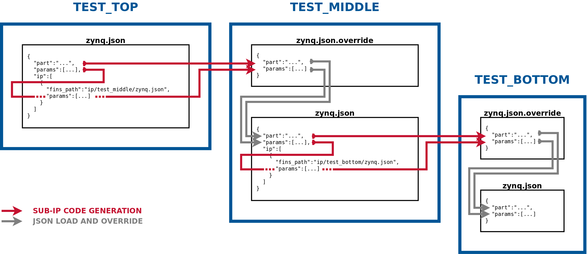

# FINS Sub-IP

**[RETURN TO TOP LEVEL README](../README.md)**

Sub-IP are FINS IP cores that have been manually instantiated within a FINS IP. Vendor cores are not included in this category and are created through the `vendor_ip` scripts of [filesets](filesets.md). FINS sub-IP are linked within the FINS JSON schema so that parameter propagation and creation of sub-IP can be automated through FINS.

## JSON Schema

The top-level `ip` field of the FINS JSON schema is an array of dictionaries that define each sub-IP. These sub-IP dictionaries in turn have several fields listed in the table below:

> NOTES: Each instance within the `ip` dictionary array must have a unique `module_name` field which matches the "component" name in the HDL. The indentations indicate another level of hierarchy for the dictionary. For example, the `name` and `parent` keys are child fields of the `params` key.

| Key                                                    | Type              | Required | Description |
| ------------------------------------------------------ | ----------------- | -------- | ----------- |
| fins_path                                              | string            | YES      | The relative filepath of the sub-IP's FINS JSON file. |
| params                                                 | dict[]            | NO       | An array of parameters of the sub-IP to link to the parameters in the current IP. |
| &nbsp;&nbsp;&nbsp;&nbsp;-name                          | string            | YES      | The name of the sub-IP's parameter. |
| &nbsp;&nbsp;&nbsp;&nbsp;-parent                        | string            | YES      | The name of the current IP's parameter to link. |
| instances                                              | dict[]            | YES      | An array of instances of this sub-IP to create |
| &nbsp;&nbsp;&nbsp;&nbsp;-module_name                   | string            | YES      | The name of the generated instance. |
| &nbsp;&nbsp;&nbsp;&nbsp;-generics                      | dict[]            | YES      | The list of VHDL generics or Verilog parameters to set for this instance. |
| &nbsp;&nbsp;&nbsp;&nbsp;&nbsp;&nbsp;&nbsp;&nbsp;+name  | string            | YES      | The name of the generic/parameter. |
| &nbsp;&nbsp;&nbsp;&nbsp;&nbsp;&nbsp;&nbsp;&nbsp;+value | string, int, bool | YES      | The value of the generic/parameter. Using a parameter for the value of this field is unsupported. |

## Code Generation

Using the `params` key of the sub-IP schema, parameters may be linked to sub-ip to propagate the customization down the hierarchy. The propagation is performed through the code generation of **.override** JSON files placed in the sub-IP's directories. The **.override** files contain the sub-IP parameter names and the values extracted from the parent-IP's parameters. These files have the same name as the FINS JSON file of the sub-IP with the **.override** extension appended. When the FINS JSON file is loaded for each sub-IP, the **.override** files are discovered and also loaded. The sub-IP parameters are then overridden for the sub-IP's code generation, and the process repeats recursively down the hierarchy. In addition to the `params` that are selectively propagated to sub-IPs, the top-level FINS JSON schema field, `part`, may also be propagated through the **.override** file. The diagram below depicts the FINS test IP as an example of the parameter propagation process.

The creation of the sub-IPs is automated through code generation of the IP build scripts.

For the `vivado` backend:

* **Makefile**: This makefile runs the build and simulation of the IP. Sub-IP Makefiles are called using the `make -C` option to dependencies are met and sub-IP changes are rebuilt.
* **ip_create.tcl**: This script builds and packages the IP. The sub-IPs are created and the `generics` are set for the instance.

For the `quartus` backend:

* **Makefile**: This makefile runs the build and simulation of the IP. Sub-IP Makefiles are called using the `make -C` option to dependencies are met and sub-IP changes are rebuilt.
* **ip_hw.tcl**: This script represents the packaged IP. The sub-IPs are created and the `generics` are set for the instance within the "elaboration" callback.

**[RETURN TO TOP LEVEL README](../README.md)**