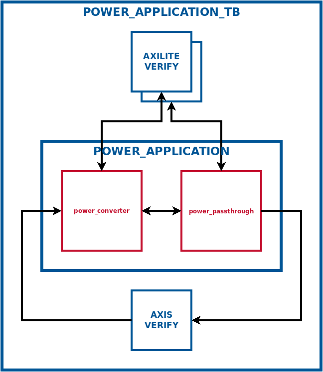
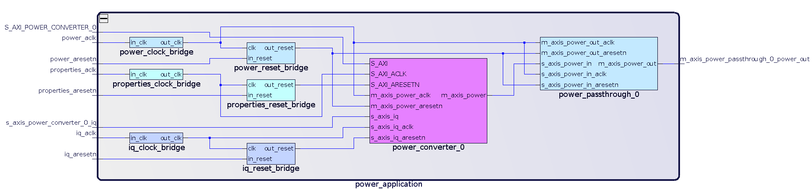

# Tutorial: FINS Application - Power Converter

**[RETURN TO TOP LEVEL README](../README.md)**

In this tutorial, we will buid on the work done in [Tutorial: FINS Node Power Converter](tutorial1.md) to create a simple FINS Application using FINS and Intel Quartus Prime Pro 19.4. This Application will include the Power Converter Node and a basic Passthrough Node. Make sure you have installed `fins` and the `fins-quartus` backed, and make sure you have completed the [first tutorial](tutorial1.md).

## Step 1: Copy the Passthrough Node into your workspace

Copy **tutorials/power_passthrough** to the same directory that contains your new **power_converter** node.
```bash
$ cp <path-to-fins>/tutorials/power_passthrough/ .
```

Your top-level directory structure should look roughly a follows:
```bash
$ tree -L 1
├── power_converter
└ ─ power_passthrough
```

## Step 2: Creating the FINS Application Specification JSON File

Create a new directory called **power_application** in the same directory where you created **power_converter** and **power_passthrough**. All filepaths for the rest of this tutorial will be relative to this directory, and it will be referenced as the "Application root" directory.

```bash
$ mkdir power_application
$ cd power_application
```

Using your favorite text editor, create a file called **fins.json** in the **power_application** directory with the following contents.

```json
{
  "name":"power_application",
  "is_application":true,
  "params": [
    { "name":"IQ_DATA_WIDTH",    "value":32 },
    { "name":"POWER_DATA_WIDTH", "value":16 }
  ],
  "nodes":[
    {
      "fins_path":"../power_converter/fins.json",
      "module_name":"power_converter_0",
      "interface_name":"S_AXI_POWER_CONVERTER_0",
      "params": [
        { "name":"IQ_DATA_WIDTH",         "parent": "IQ_DATA_WIDTH" },
        { "name":"POWER_DATA_WIDTH",      "parent": "POWER_DATA_WIDTH" }
      ]
    },
    {
      "fins_path":"../power_passthrough/fins.json",
      "module_name":"power_passthrough_0",
      "params": [
        { "name":"POWER_DATA_WIDTH", "parent": "POWER_DATA_WIDTH" }
      ]
    }
  ],
  "connections":[
    {
      "source":{"node_name":"power_converter_0", "net":"power"},
      "destinations":[
        {"node_name":"power_passthrough_0", "net":"power_in"}
      ]
    }
  ],
  "clocks":[
    {
      "clock":"iq",
      "nets":[
        {"node_name":"power_converter_0",   "net":"iq"}
      ]
    },
    {
      "clock":"power",
      "nets":[
        {"node_name":"power_converter_0",   "net":"power"},
        {"node_name":"power_passthrough_0", "net":"power_in"},
        {"node_name":"power_passthrough_0", "net":"power_out"}
      ]
    }
  ],
  "filesets":{
    "sim":[
      { "path":"../power_converter/gen/core/power_converter_axilite_verify.vhd" },
      { "path":"./gen/core/power_application_pkg.vhd" },
      { "path":"./gen/core/power_application_axis_verify.vhd" },
      { "path":"./gen/core/power_application_tb.vhd" }
    ],
    "scripts":{
      "postsim":[
        { "path":"scripts/verify_sim.py" }
      ]
    }
  }
}
```

In the **fins.json** file we just created, we have defined:
1. Two "params" which override params of the Nodes in this Application. See [here](parameters.md) for more information about parameters.
2. A list of FINS "nodes" to be instantiated and connected in this Application. Each Node's property interface is assigned a meaningful name, and Node parameters are overwritten by parameters of the Application. FINS code-generation instantiates the nodes listed here in a backend/tool-specific block design (Vivado Block Design or Quartus Platform Designer System). For more information on the fields of each "nodes" entry see [here](applications.md).
3. Connections between Node ports. For more information on "connections" see [here](applications.md).
3. Clock domains and their assignments to ports. For more information on "clocks" see [here](applications.md).

## Step 3: Auto-generating Block Designs and HDL

Next, run `fins` using the **fins.json** file as the command line argument.

```bash
$ fins fins.json
```

Once that operation completes, inspect the **./gen/core** directory to find the files listed below.
* **power_application.json**: This is the implemented FINS Application JSON data used to generate the templates, and it has all default values set and parameter names converted to literal values. It is a good place to check to make sure that the **fins.json** file that you wrote is getting interpreted properly.
* **power_application_axis_verify.vhd**: This is a testbench module that reads and writes files with AXI4-Stream bus data.
* **power_application_tb.vhd**: This is a simple default testbench that verifies the ports and properties interfaces.

## Step 4: Adding the Filesets

Modify your **fins.json** file to add the following code after the `connections` top-level key. Remember to use a comma after the closing square brace (`]`) of `connections`!

```json
  "filesets":{
    "sim":[
      { "path":"../power_converter/gen/core/power_converter_axilite_verify.vhd" },
      { "path":"./gen/core/power_application_pkg.vhd" },
      { "path":"./gen/core/power_application_axis_verify.vhd" },
      { "path":"./gen/core/power_application_tb.vhd" }
    ],
    "scripts":{
      "postsim":[
        { "path":"scripts/verify_sim.py" }
      ]
    }
  }
```

The `filesets` top-level key indicates which files are used in the Application project. For Applications in particular, HDL files can only be added for simulation purposes. Notice that a few of the files are located in the **gen/core/** directory. These files are auto-generated and accordingly updated with the `fins` code generator executable. Since FINS manages these files, the burden of creating and maintaining these files is removed from the developer!

A few files pointed to here are from the Nodes in this Application. They are for property access and verification, and provide other utility in the Application testbench.

The `filesets` key also contains a reference to a script that is executed after the simulation process `scripts/verify_sim.py`.

The following diagram illustrates how the Application block design connects to the generated testbench for verification.


### Copy simulation files into the application

First we need to create a data-source file called **sim_source_power_converter_0_iq.txt**. This will drive the "iq" input port of the **power_converter** node. This filename matches the default used in the testbench VHDL and is derived from the Node's `module_name` in **fins.json**.

Create a directory **./sim_data** in the Application root to contain our simulation files. **./sim_data** is the generated testbench's default location for source/sink files. Since this Application is just a **power_converter** Node connected to a passthrough Node, just copy over the simulation data from the **power_converter** tutorial.

```bash
$ mkdir sim_data
$ cp ../power_converter/sim_data/sim_source_iq.txt sim_data/sim_source_power_converter_0_iq.txt
```

We now create a verification script with contents nearly identical to that of the **power_converter** tutorial except for the imported module name and source/sink filenames.

```bash
$ mkdir scripts
```

Within the **scripts** directory, create a file called **verify_sim.py** with the contents below.

```python
#!/usr/bin/env python3
import sys

# Import auto-generated parameters file
sys.path.append('gen/core/')
import power_application_pkg

# Open our simulation input
sim_source_data = {'last':[], 'data':{'i':[], 'q':[]} }
with open('sim_data/sim_source_power_converter_0_iq.txt', 'r') as sim_source_file:
    for sim_source_line in sim_source_file:
        line_data = sim_source_line.split(' ')
        sim_source_data['last'].append(int(line_data[0], 16))
        sim_source_data['data']['q'].append(int(line_data[1][0:4], 16))
        sim_source_data['data']['i'].append(int(line_data[1][4:8], 16))

# Open our simulation output
sim_sink_data = {'last':[], 'data':[]}
with open('sim_data/sim_sink_power_passthrough_0_power_out.txt', 'r') as sim_sink_file:
    for sim_sink_line in sim_sink_file:
        line_data = sim_sink_line.split(' ')
        sim_sink_data['last'].append(int(line_data[0], 16))
        sim_sink_data['data'].append(int(line_data[1], 16))

# Implement the algorithm
sim_expected_data = []
for ix in range(len(sim_source_data['data']['i'])):
    sim_expected_data.append(sim_source_data['data']['i'][ix]**2 + sim_source_data['data']['q'][ix]**2)

if sim_expected_data == sim_sink_data['data']:
    print('PASS: power simulation data is correct')
else:
    print('ERROR: power simulation data is incorrect')
    print('    * Expected: {}'.format(sim_expected_data))
    print('    * Received: {}'.format(sim_sink_data['data']))
    sys.exit(1)
```

This script is referenced as `postsim` in the JSON's `filesets`, so it will run _after_ simulation completes.

## Step 5: Building the Application with Intel Quartus Prime Pro

To auto-generate Intel Quartus Prime Pro TCL scripts and a **Makefile**, execute the following commands.

```bash
$ fins -b quartus fins.json
```

Inspect the **./gen/quartus** directory to find the auto-generated Intel Quartus Prime Pro TCL scripts listed below.

* **nodes_instantiate.tcl**: This is a Platform Designer Tcl script that instantiates and connects the Nodes of this Application.
* **application_create.tcl**: This is the script that the **Makefile** will use to create a Quartus Platform Designer System (QSYS). It calls **nodes_instantiate.tcl** and then exports property interfaces and unconnected ports to become externals of the QSYS. It also manages connections to clocks and resets of the Nodes. 
* **application_simulate.tcl**: This is the script that will run the simulation in the next step of this tutorial.

To package and build the Application with Intel Quartus Prime Pro, execute the following commands.

> NOTE: Make sure you have the path to the `quartus` executable on your `PATH` environmental variable for the version of Intel Quartus that you want to use.

```bash
$ make clean
$ make UseGui=1
```

The `UseGui=1` make variable tells FINS to display the Quartus messages to the command window. Since Quartus has a more command-line flow, the Quartus GUI is not opened. Once the operations have completed, check the command line console output to make sure that there were no errors. Look inside the **./project/quartus** directory and you will find the **power_application.qpf** project file that was created and the **power_application.qsys** Platform Designer System definition file.

You can open up the Application in the Platform Designer GUI to inspect:
```bash
qsys-edit --quartus_project=power_application.qpf power_application.qsys
```



## Step 6: Simulating the Application with ModelSim

Execute the following command to run the simulation with the ModelSim GUI.

> NOTE: This command assumes that you have followed this tutorial exactly and results of the the previous steps are located in the repository.

```bash
$ make sim UseGui=1
```
In the ModelSim GUI, notice the "***** SIMULATION PASSED *****" message in the Transcript window. Click "Yes" in the dialog message that asks if you want to quit.

Verify all the commands completed without error, and check the log files after each `make sim` to ensure the Python script passed!

## Solution

The solution files for this tutorial are located in the **tutorials/power_application** directory of the FINS repository.

**[RETURN TO TOP LEVEL README](../README.md)**
